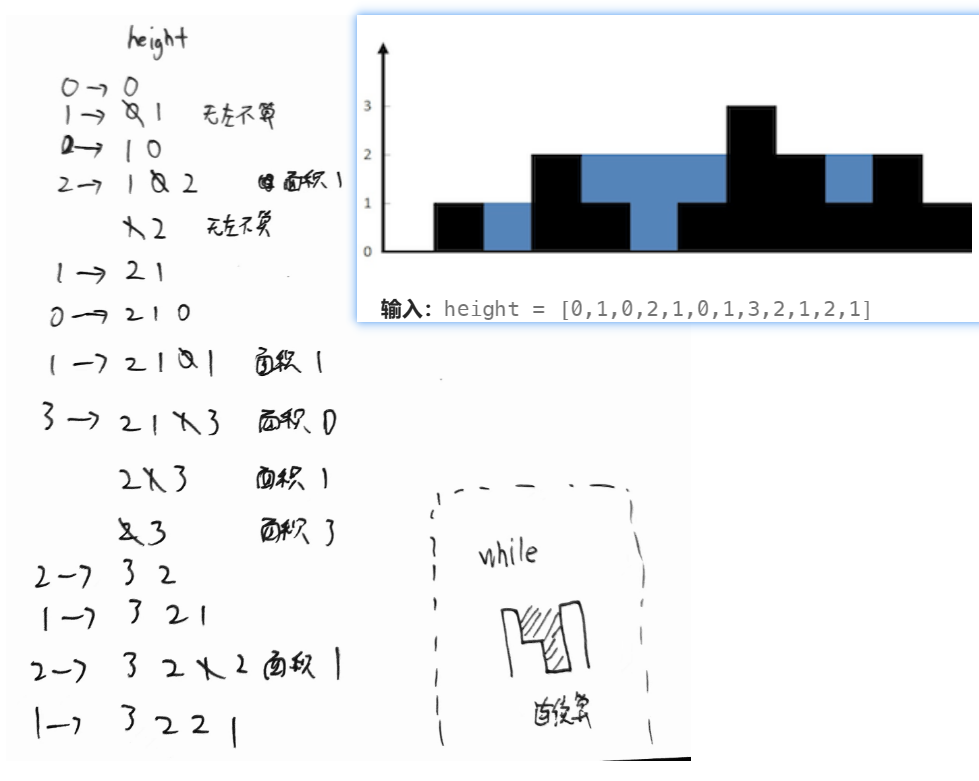

- [11.盛最多水的容器](#11盛最多水的容器)
- [42.接雨水](#42接雨水)

---
## 11.盛最多水的容器

- 线：`volume = (j-i) * min(arr[j], arr[i])`
- 最小边移动，还可以连续移动，让新边更高；
```java
class Solution {
    public int maxArea(int[] height) {
        int i = 0, j = height.length - 1;
        int volume = 0;
        while (i < j) {
            int min = Integer.min(height[i], height[j]);
            volume = Integer.max(volume, (j - i) * min);
            if (height[i] < height[j]) {
                int left = height[i];
                // 让新边更高；
                while (height[i] <= left && i < j) {
                    i++;
                }
            } else {
                int right = height[j];
                while (height[j] <= right && i < j) {
                    j--;
                }
            }
        }
        return volume;
    }
}
```

## 42.接雨水



单调栈。新元素入栈，需要弹出小于它的老元素。

弹出时，以弹出元素为底，以弹出后的新栈底为左。雨水为新墙和老墙围起来且不包括底的部分。

`volume = (j-i-1) * (min(arr[j], arr[i]) - bottom)`

```java
class Solution {
    public int trap(int[] height) {
        LinkedList<Data> stack = new LinkedList<>();
        int result = 0;

        for(int i = 0 ; i < height.length; i++){
            while(!stack.isEmpty() && stack.peek().height < height[i]){
                Data bottom = stack.poll();
                Data nextLeft = stack.peek();
                if(nextLeft != null){
                    int w = i - nextLeft.i - 1;
                    int h = Math.min(nextLeft.height, height[i]) - bottom.height;
                    result += w * h;
                }
            }
            stack.push(new Data(height[i], i));
        }
        return result;
    }
}

class Data{
    int height;
    int i;

    Data(int height, int i){
        this.height = height;
        this.i = i;
    }
}
```