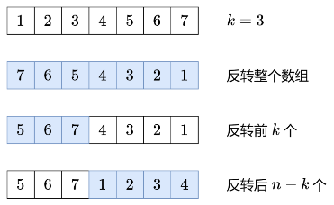
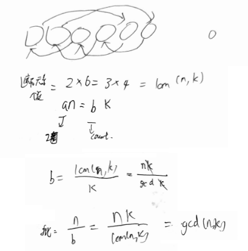

`k = k % nums.length;` 重要优化

## 额外数组
```java
// 189. 轮转数组
class Solution {
    public void rotate(int[] nums, int k) {
        k = k % nums.length;
        int[] res = new int[nums.length];
        System.arraycopy(nums, 0, res, k, nums.length - k);
        System.arraycopy(nums, nums.length - k, res, 0, k);
        System.arraycopy(res, 0, nums, 0, nums.length);
    }
}
```
## 反转

```java
// 189. 轮转数组
class Solution {
    public void rotate(int[] nums, int k) {
        k = k % nums.length;
        reverse(nums, 0, nums.length - 1);  // 整体
        reverse(nums, 0, k - 1);  // 前部分
        reverse(nums, k, nums.length - 1);  // 后部分
    }

    public void reverse(int[] arr, int i, int j){
        while(i < j){
            int t = arr[i];
            arr[i] = arr[j];
            arr[j] = t;
            i++;
            j--;
        }
    }
}
```
## 环状替换


```java
class Solution {
    public void rotate(int[] nums, int k) {
        int n = nums.length;
        k = k % n;
        int patch = gcd(n, k);
        int b = n / patch;
        for(int i = 0; i < patch; i++){
            int start = i;
            int pre = nums[start];
            for(int j = 0; j < b; j++){
                int nextStart = (start + k) % n;
                int temp = nums[nextStart];
                nums[nextStart] = pre;
                start = nextStart;
                pre = temp;
            }
        }
    }

    // 最大约数
    // (6, 4); (4, 6) 第一轮会变成(6, 4)
    public int gcd(int x, int y){
        return y > 0 ? gcd(y, x%y): x;
    }
}
```