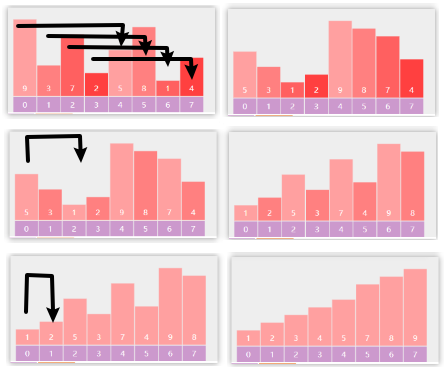

[toc]

## 插入排序

### 算法流程


- 将数组分为已排序部分和待插入部分：`[0 .. i-1]`  `[i.. n-1]`。则i的下标 `[1, n-1]`
- 每次从待插入区域取出第一个元素, 即i下标，插入到已排序区域
- 插入到已排序区域：从i倒着往前，检查 i 左边的元素 `int j = i - 1;`，如果左边大于 i 所在的元素 `nums[j] > t`，就右移数组 `nums[j+1] = nums[j]`

```java
class Solution {
    public int[] sortArray(int[] nums) {
        int n = nums.length;
        // 内循环：未排序区间 [i, n-1]
        // 外循环: 则i属于[0, n-1]
        for(int i = 0; i < n; i++){
        	// 因为会覆盖 i 下标的元素，所以要保存到临时变量
            int t = nums[i];
            int j = i - 1;
            while(j >=0 && nums[j] > t){		// nums[j] >= t 就是不稳定了
                nums[j+1] = nums[j];
                j--;
            }
            nums[j+1] = t;	// 当前是不符合的位置 nums[j] <= t，所以插入到下一个位置
        }
        return nums;
    }
}
```
### 算法特性

- **时间复杂度为 $O(n^2)$、自适应排序**：
  - 在最差情况下，每次插入操作分别需要循环 $n - 1$、$n-2$、$\dots$、$2$、$1$ 次，求和得到 $(n - 1) n / 2$ ，因此时间复杂度为 $O(n^2)$ 。
  - 当输入数组完全有序时，不插入，只遍历，达到最佳时间复杂度 $O(n)$ 。

- **空间复杂度为 $O(1)$、原地排序**：指针 $i$ 和 $j$ 使用常数大小的额外空间。
- **稳定排序**：在插入操作过程中，我们会将元素插入到相等元素的右侧，不会改变它们的顺序。

## 希尔排序

插入排序改进：插入排序如果第一个元素是9，那么它要被移动n次；而希尔排序从大gap往小gap走，移动9的步幅很大，$\log_2 n$就足以。


* 根据步幅gap实现分组的插入排序
* 每轮排序后 gap 逐渐变小，直至 gap 为 1 完成排序 


```java
public int[] sortArray(int[] nums) {
    // gap 不断除2，直到1
    for (int gap = nums.length / 2; gap > 0; gap /= 2) {
        // 1替换为gap
        for (int low = gap; low < nums.length; low++) {
            int t = nums[low];
            int i = low - gap;
            while (i >= 0 && nums[i] > t) {
                nums[i + gap] = nums[i];
                i -= gap;
            }
            if (i != low - gap) {
                nums[i + gap] = t;
            }
        }
    }
    return nums;
}
```
