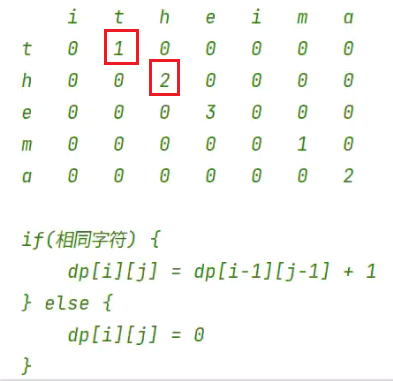
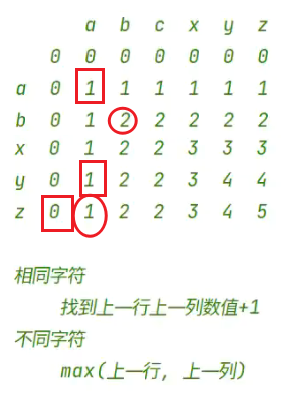

[toc]

## 最长公共子串



## 最长公共子序列


### LCR 095. 最长公共子序列
```java
class Solution {
    public int longestCommonSubsequence(String text1, String text2) {
        int m = text1.length();
        int n = text2.length();
        char[] charA = text1.toCharArray();
        char[] charB = text2.toCharArray();
        int[][] dp = new int[m + 1][n + 1];

        for (int i = 1; i <= m; i++) {
            for (int j = 1; j <= n; j++) {
                if (charA[i - 1] == charB[j - 1]) {
                    dp[i][j] = dp[i - 1][j - 1] + 1;
                } else {
                    dp[i][j] = Math.max(dp[i - 1][j], dp[i][j - 1]);
                }
            }
        }
        return dp[m][n];
    }
}
```
### 583. 两个字符串的删除操作
去除掉最长公共子序列的长度。
```java
class Solution {
    public int minDistance(String word1, String word2) {
        int m = word1.length();
        int n = word2.length();
        char[] charA = word1.toCharArray();
        char[] charB = word2.toCharArray();
        int[][] dp = new int[m + 1][n + 1];

        for (int i = 1; i <= m; i++) {
            for (int j = 1; j <= n; j++) {
                if (charA[i - 1] == charB[j - 1]) {
                    dp[i][j] = dp[i - 1][j - 1] + 1;
                } else {
                    dp[i][j] = Math.max(dp[i - 1][j], dp[i][j - 1]);
                }
            }
        }
        return m + n - 2 * dp[m][n];
    }
}
```

## 300. 最长递增子序列


```java
class Solution {
    public int lengthOfLIS(int[] nums) {
        int[] dp = new int[nums.length];
        Arrays.fill(dp, 1);
        int max = 1;
        for (int i = 1; i < nums.length; i++) {
            for (int j = 0; j < i; j++) {
                if(nums[i] > nums[j]){
                    dp[i] = Math.max(dp[i], dp[j] + 1);
                }
            }
            max = Math.max(dp[i], max);
        }
        return max;
    }
}
```