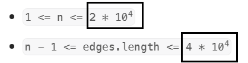

[toc]

稀疏图稠密图：“边”和“点”的数量在一个数量级上



- 稀疏图；链式前向星
- 稠密图：邻接矩阵

## 边数组 edges

```java
// [[2,1,1],[2,3,1],[3,4,1]] from节点、to节点、权重
int[][] edges = new int[M][3];
```
只存有连接的边。

## 邻接矩阵 w

```java
// n个节点
int[][] w = new int[n + 1][n + 1];

for (int[] each : w) {
    Arrays.fill(each, -1);
}
for (int i = 1; i <= n; i++) {
    w[i][i] = 0;
}
for (int[] edge : edges) {
    int from = edge[0], to = edge[1], weight = edge[2];
    w[from][to] = weight;
    w[to][from] = weight;    // 有向图就注释
}
```

自身是0，有权是c，不连接是
- 0：权非0的普通情况
- -1：有些题的权是0，那么就得区分不连接和自身
- INF: Dijkstra的不连接是INF，那么可以不判断相邻。

[9.2  图基础操作 - Hello 算法 (hello-algo.com)](https://www.hello-algo.com/chapter_graph/graph_operations/#921)

## 邻接表


邻接表的链表，其中存储了各顶点的与各自相连的邻接顶点。


邻接表和邻接矩阵的区别就是：

- 邻接矩阵存权重，邻接表只记录是否有边。

- 邻接矩阵for循环找到边节点快，但空间O(n^2)

  邻接表仅存储实际存在的边，查找O(n)。

  当链表较长时，可以将链表转化为 AVL 树或红黑树，从而将时间效率从 𝑂(𝑛) 优化至 𝑂(log⁡𝑛) ；还可以把链表转换为哈希表，从而将时间复杂度降至 𝑂(1) 。


### 链式前向星spa

- 插入过程的更新

  ```java
  // N个节点，M条边
  
  // 边→指向的节点
  int[] e = new int[M];
  // 边链表的下一个边编号，0 表示没有下一个边
  int[] ne = new int[M];
  // 边的权重
  int[] w = new int[M];
  
  int[] head = new int[n + 1];		// 节点from 的边链表的头边是 边idx
  int[] w = new int[m + 1];			// 边idx 的权重是 w
  int[] eTo = new int[m + 1];			// 边idx 指向 节点to
  int[] eNext = new int[m + 1];		// 边链表上的下一条边是 边idx
  
  
  // 边的编号：插入一条边就自增，我们从1自增
  int idx = 1;
  for (int[] edge : edges) {
      int from = edge[0], to = edge[1], weight = edge[2];
      // 头插法：下一个边指向原来的头边，头边更新为新边
      w[idx] = weight;
      eTo[idx] = to;
      eNext[idx] = head[from];
      head[from] = idx;
      idx++;
  }
  ```

  

- 遍历节点cur 的边链表（遍历某个点的所有边）

  ```java
  // 节点cur 的边链表：头边是 head[cur]
  for (int idx = head[cur]; idx != 0; idx = eNext[idx]) {
      // 相邻的节点
      int node = eTo[idx];
      // 边的权重
      int weight = w[idx];
  }
  ```

### 链表

[9.2  图基础操作 - Hello 算法 (hello-algo.com)](https://www.hello-algo.com/chapter_graph/graph_operations/#922)

### 集合数组

🚀 [207. 课程表.md](..\..\题\leetcode\207. 课程表.md)：如何邻接表集合数组

 [797. 所有可能的路径.md](..\..\题\leetcode\797. 所有可能的路径.md)：给出的输入数据是这样

## 类Vertex/Edge
