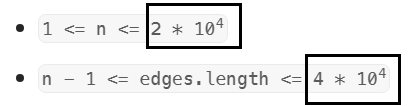
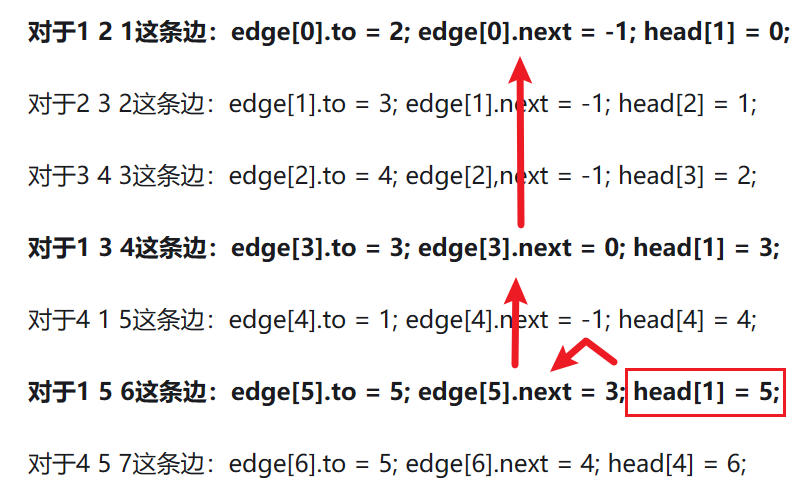

[toc]

存图方式：边数组、邻接矩阵、邻接表（链式前向星）、类Vertex/Edge。

稀疏图稠密图：“边”和“点”的数量在一个数量级上



- 稀疏图；链式前向星
- 稠密图：邻接矩阵

## 边数组 edges

```java
// [[2,1,1],[2,3,1],[3,4,1]] from节点、to节点、权重
int[][] edges = new int[M][3];
```
只存有连接的边。

## 邻接矩阵 w

```java
int[][] w = new int[N][N];
```

自身是0，有权是c，不连接是
- 0：权非0的普通情况
- -1：有些题的权是0，那么就得区分不连接和自身
- INF: Dijkstra的不连接是INF，那么可以不判断相邻。

[9.2  图基础操作 - Hello 算法 (hello-algo.com)](https://www.hello-algo.com/chapter_graph/graph_operations/#921)

## 链式 前向星


```java
// 边的编号：插入一条边就自增
int idx = 1;    // 我们从1自增，保持一致
// N节点，M边
// 边→指向的节点
int[] e = new int[M];
// 起始节点→所对应的边链表的头结点的边编号；
int[] he = new int[N];  // 我们就用0作为边`ne[idx] = he[from];`的无下一个赋值。
// 边→同一起始节点所对应的链表中的下一个边编号。
int[] ne = new int[M];
// 边的权重
int[] w = new int[M];


public void add_spa(int from, int to, int weight){
    e[idx] = to;
    // 头插法
    // 下一个边指向原来的头节点，头节点更新为新边
    ne[idx] = he[from];
    he[from] = idx;
    w[idx] = weight;
    idx++;
}
```

插入过程的更新和遍历过程

```java
// 由 cur 点发出的边 i
for (int i = he[cur]; i != 0; i = ne[i]) {
    // 边 i 指向的节点 node，权重 weight：即由 cur 指向 node 的边，权重为 weight
    int node = e[i];
    int weight = w[i];
}
```


## 邻接表


邻接表的链表，其中存储了各顶点的与各自相连的邻接顶点。


邻接表和邻接矩阵的区别就是：

​	邻接矩阵存权重，邻接表只记录是否有边。

​	邻接矩阵for循环找到边节点快，但空间O(n^2)

​	邻接表仅存储实际存在的边，而边的总数通常远小于 𝑛2 ，因此它更加节省空间。


比如当链表较长时，可以将链表转化为 AVL 树或红黑树，从而将时间效率从 𝑂(𝑛) 优化至 𝑂(log⁡𝑛) ；还可以把链表转换为哈希表，从而将时间复杂度降至 𝑂(1) 。

[9.2  图基础操作 - Hello 算法 (hello-algo.com)](https://www.hello-algo.com/chapter_graph/graph_operations/#922)

 [207. 课程表.md](..\..\题\leetcode\207. 课程表.md) 
