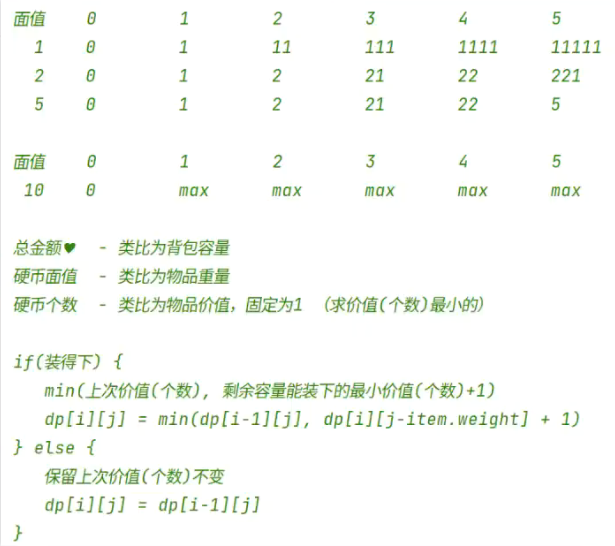

## 非322题：只是获取所有可能解的具体硬币情况

```java
class Solution {
    int[] coins;
    LinkedList<Integer> stack = new LinkedList<>();

    public int coinChange(int[] coins, int amount) {
        this.coins = coins;
        int count = rec(0, amount, true);
        return count;
    }

    public int rec(int idx, int remainer, boolean first) {
        if (!first) {
            stack.add(coins[idx]);
        }
        int count = 0;
        if (remainer < 0) {
            System.out.println("无解 " + stack);
        } else if (remainer == 0) {
            System.out.println("有解 " + stack);
            count++;
        } else {
            for (int i = idx; i < coins.length; i++) {
                count += rec(i, remainer - coins[i], false);
            }
        }
        if (!stack.isEmpty()) {
            stack.pop();
        }
        return count;
    }
}
```

## 贪心（不能通过全部测试）

```java
class Solution {
    public int coinChange(int[] coins, int amount) {
        Integer[] c = Arrays.stream(coins).boxed().toArray(Integer[]::new);
        Arrays.sort(c, (a, b) -> b - a);
        coins = Arrays.stream(c).mapToInt(Integer::valueOf).toArray();
        int count = 0;
        for (int coin : coins) {
            while (amount > coin) {
                amount -= coin;
                count++;
            }
            if (amount == coin) {
                amount -= coin;
                count++;
                break;
            }
        }
        if (amount == 0) {
            return count;
        } else {

            return -1;
        }
    }
}
```

## 动态

硬币无限，**求最少的硬币个数**。

1. 硬币是物品重量，总额是背包大小，硬币个数是物品价值.
2. 一开始初始化为最大值。每次更新是min物品价值。


```java
class Solution {
    public int coinChange(int[] coins, int amount) {
        int[] dp = new int[amount + 1];
        for (int j = 1; j <= amount; j++) {
            if (j >= coins[0]) {
                dp[j] = 1 + dp[j - coins[0]];
            } else {
                dp[j] = amount + 1;
            }
        }
        for (int i = 1; i < coins.length; i++) {
            for (int j = 1; j <= amount; j++) {
                if (j >= coins[i]) {
                    dp[j] = Math.min(dp[j], 1 + dp[j - coins[i]]);
                }
            }
        }
        return dp[amount] >= amount + 1 ? -1 : dp[amount];
    }
}
```