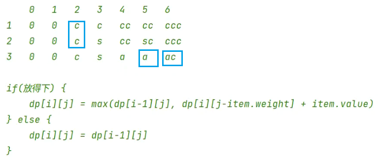

[toc]

## 背包问题
背包问题：分数背包(贪心）、0-1背包（动态规划）、完全/无限背包（动态规划）。

> 分数背包：贪心策略，选额单价最高。

> 0-1背包：整个物品。上一行

> 完全背包：无限物品。本行


## 分数背包
- 按照单价逆序。
- 遍历装入背包，判断拿完和拿不完。拿完就装入，减小容量；拿不完，就装入部分，把剩余空间填满。


## 01背包

不需要物品价值排序。

对着每个物品，进行[0, 最大背包容量]的依次计算。得到 n x cap 的数组。

`dp[i][c]`表示前`[0...i]`个物品一起考虑后对应的不同容量背包`[0...cap]`下的最大价值。


最终返回的是`dp[n-1][cap]`（不是`[cap-1]`）

​	物品可以从0开始，[0, n-1]；

​	背包必须包含0和n，0表示没装东西，n表示最大容量。

```java
// https://www.luogu.com.cn/problem/P1048	采药
import java.util.*;

public class Main {
    public static void main(String[] args) {
        Scanner sc = new Scanner(System.in);
        int cap = sc.nextInt(), n = sc.nextInt();
        int[] w = new int[n];
        int[] v = new int[n];
        int i = 0;
        while (i < n) {
            w[i] = sc.nextInt();
            v[i] = sc.nextInt();
            i++;
        }
        Solution solution = new Solution();
        int res = solution.pack01(w, v, n, cap);
        System.out.println(res);

    }
}

class Solution {
    // n个物品，cap背包容量
    public int pack01(int[] w, int[] v, int n, int cap) {
        int[][] dp = new int[n][cap + 1];
        // 列
        for (int i = 0; i < n; i++) {
            dp[i][0] = 0;
        }
        // 行
        for (int c = 0; c <= cap; c++) {
            if (w[0] <= c) {
                dp[0][c] = v[0];
            }
        }
        for (int i = 1; i < n; i++) {
            for (int c = 1; c <= cap; c++) {
                if (w[i] > c) {
                    dp[i][c] = dp[i - 1][c];
                } else {
                    dp[i][c] = Math.max(dp[i - 1][c], dp[i - 1][c - w[i]] + v[i]);
                }
            }
        }
        return dp[n - 1][cap];
    }
}
```


倒着。因为需要上一行j前面的结果不变，所以正序不行，得倒序。


## 完全背包




因为都是同一行，所以不需要初始化第一行。


## 总结

- 二维简化为一维：如果依赖旧的，就倒序。
- 初始化而跳过预备元素：[初始化而跳过预备元素](<198. 打家劫舍.mdom/itheima/algorithm/dynamicprogramming/leetcode/198. 打家劫舍.md>)