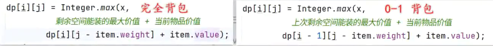

[toc]

## 背包问题
背包问题：分数背包(贪心）、0-1背包（动态规划）、完全/无限背包（动态规划）。

> 分数背包：贪心策略，选额单价最高。

> 0-1背包：整个物品。上一行

> 完全背包：无限物品。本行



## 分数背包
- 按照单价逆序。
- 遍历装入背包，判断拿完和拿不完。拿完就装入，减小容量；拿不完，就装入部分，把剩余空间填满。


## 01背包：最大价值

不需要物品价值排序。


### n x (cap+1)

对着每个物品，进行[0, 最大背包容量]的依次计算。得到 n x (cap+1) 的数组。

`dp[i][c]`表示前`[0...i]`个物品一起考虑后对应的不同容量背包`[0...cap]`下的最大价值。


边界条件 `列首dp[x][0]=0，首行dp[0][x]=0||v[0]`


递推公式 

$dp[i][c] =  \begin{cases}  dp[i-1][c], & \text{if } c < w[i] \\ \max(dp[i-1][c], dp[i-1][c - w[i]] + v[i]), & \text{if } c \geq w[i] \end{cases}$


最终返回的是`dp[n-1][cap]`（不是`[cap-1]`）

​	物品可以从0开始，[0, n-1]；

​	背包必须包含0和n，0表示没装东西，n表示最大容量。


```java
/* 0-1 背包：动态规划 */
public int pack01(int[] w, int[] v, int n, int cap) {
    int[][] dp = new int[n][cap + 1];
    // 列首空：当背包容量为0时，最大价值是0
    // for (int i = 0; i < n; i++) {
    //    dp[i][0] = 0;
    // }
    // 首行
    for (int c = 0; c <= cap; c++) {
        if (c >= w[0]) {
            dp[0][c] = v[0];
        }
    }
    // 从第二个物品开始
    for (int i = 1; i < n; i++) {
        for (int c = 1; c <= cap; c++) {
            if (c >= w[i]) {
                // 装的下：不选和选物品 i 这两种方案的较大值
                dp[i][c] = Math.max(dp[i - 1][c], dp[i - 1][c - w[i]] + v[i]);
            } else{
	            // 装不下：则不选物品 i
                dp[i][c] = dp[i - 1][c];
            }
        }
    }
    return dp[n - 1][cap];
}

/* 0-1 背包：空间优化后的动态规划 */
public int pack01(int[] w, int[] v, int n, int cap) {
    int[] dp = new int[cap + 1];
    // 列首空 dp[0] = 0;
    // 首行
    for (int c = 0; c <= cap; c++) {
        if (c >= w[0]) {
            dp[c] = v[0];
        }
    }
    for (int i = 1; i < n; i++) {
        for (int c = cap; c >= 0; c--) {
	        // 倒序遍历!!!!! 因为正序修改后面依赖的上行历史数据，变成了本行的最新数据
            // 装不下：则不变
            // 装的下：不选和选物品 i 这两种方案的较大值
            if (c >= w[i]) {
	            dp[c] = Math.max(dp[c], dp[c - w[i]] + v[i]);
            }
        }
    }
    return dp[cap];
}
```

### (n+1) x (cap+1)

对着每个物品（包括0个物品），进行[0, 最大背包容量]的依次计算。得到 (n+1) x (cap+1) 的数组。

`dp[i][c]`表示前i个物品（`w[0...i-1]`）一起考虑后对应的不同容量背包`[0...cap]`下的最大价值。


边界条件 

让第一个物品是`0||v[0]`，让其归入到递推公式中，则`列首dp[x][0]=0，首行dp[0][x]=0`（刚好都是默认0）


递推公式 （判断和公式中的w和v是i-1）

$dp[i][c] =  \begin{cases}  dp[i-1][c], & \text{if } c < w[i-1]\\ \max(dp[i-1][c], dp[i-1][c - w[i-1]] + v[i-1]), & \text{if } c \geq w[i-1] \end{cases}$


最终返回的是`dp[n][cap]`（不是`[n-1]`）

​	实际物品可以从1开始，[1, n]；

​	背包必须包含0和n，0表示没装东西，n表示最大容量。

```java
/* 0-1 背包：动态规划 */
public int pack01(int[] w, int[] v, int n, int cap) {
    int[][] dp = new int[n+1][cap + 1];
    // 从第1个物品开始，包括n
    for (int i = 1; i <= n; i++) {
        for (int c = 1; c <= cap; c++) {
            if (c >= w[i-1]) {
                // 装的下：不选和选物品 i 这两种方案的较大值
                dp[i][c] = Math.max(dp[i - 1][c], dp[i - 1][c - w[i-1]] + v[i-1]);
            } else{
	            // 装不下：则不选物品 i
                dp[i][c] = dp[i - 1][c];
            }
        }
    }
    return dp[n][cap];
}

/* 0-1 背包：空间优化后的动态规划 */
public int pack01(int[] w, int[] v, int n, int cap) {
    int[] dp = new int[cap + 1];
    for (int i = 1; i <= n; i++) {
        for (int c = cap; c >= 0; c--) {
	        // 倒序遍历!!!!! 因为正序修改后面依赖的上行历史数据，变成了本行的最新数据
            // 装不下：则不变
            // 装的下：不选和选物品 i 这两种方案的较大值
            if (c >= w[i-1]) {
	            dp[c] = Math.max(dp[c], dp[c - w[i-1]] + v[i-1]);
            }
        }
    }
    return dp[cap];
}
```


### 练习

 [洛谷P1048 采药.md](..\..\题\其他\洛谷P1048 采药.md) 

 [洛谷P1049 装箱问题.md](..\..\题\其他\洛谷P1049 装箱问题.md) 

## 01背包：刚好价值的方案

```java
public int pack01(int[] w, int n, int cap) {
    int[] dp = new int[cap + 1];
    for (int i = 1; i <= n; i++) {
        for (int c = cap; c >= 0; c--) {
            // 没钱，则同历史方案数
            if( c < w[i-1]){
                // 则不变
            }
            // 刚好，那就再多一个只吃它的方案
            else if (c == w[i-1]) {
                dp[c] = dp[c] + 1;
            }
            // 超额，那么多的是 dp[c - w[i-1]] 表示吃（它，其他）的套餐。
            else{
                dp[c] = dp[c] + dp[c - w[i-1]];
            }
        }
    }
    return dp[cap];
}
```

 [洛谷P1164 小A点菜.md](..\..\题\其他\洛谷P1164 小A点菜.md) 

## 完全背包

**每个物品可以重复选取**，所以看的是本行的最大价值（最新的）

$dp[i, c] = \max(dp[i-1, c], dp[i, c - w[i]] + v[i])$


```java
/* 完全背包：动态规划 */
public long packInfinity(int[] w, int[] v, int n, int cap) {
    long[][] dp = new long[n][cap + 1];
    // 列首是0，使用默认
    // 第一行
    for (int c = 1; c <= cap; c++) {
        if (w[0] <= c) {
            dp[0][c] = dp[0][c - w[0]] + v[0];
        }
    }
    for (int i = 1; i < n; i++) {
        for (int c = 1; c <= cap; c++) {
	        if (w[0] <= c) {            
                // 装的下：不选和选物品 i 这两种方案的较大值
                dp[i][c] = Math.max(dp[i - 1][c], dp[i][c - w[i]] + v[i]);
            } else {
                dp[i][c] = dp[i - 1][c];
            }
        }
    }
    return dp[n - 1][cap];
}
```

因为都是同一行，所以既不需要倒序，而且也不需要初始化第一行。

```java
/* 完全背包：动态规划 */
public long packInfinity(int[] w, int[] v, int n, int cap) {
    long[] dp = new long[cap + 1];
    // 列首是0，使用默认
    for (int i = 0; i < n; i++) {
        for (int c = 1; c <= cap; c++) {
            // 装不下就维持不变
            if (w[i] <= c) {
                // 装的下：不选和选物品 i 这两种方案的较大值
                dp[c] = Math.max(dp[c], dp[c - w[i]] + v[i]);
            }
        }
    }
    return dp[cap];
}
```

 [洛谷P1616 疯狂的采药.md](..\..\题\其他\洛谷P1616 疯狂的采药.md) 

## 总结

- 二维简化为一维：如果依赖旧的，就倒序。
- 初始化而跳过预备元素：[初始化而跳过预备元素](<198. 打家劫舍.mdom/itheima/algorithm/dynamicprogramming/leetcode/198. 打家劫舍.md>)