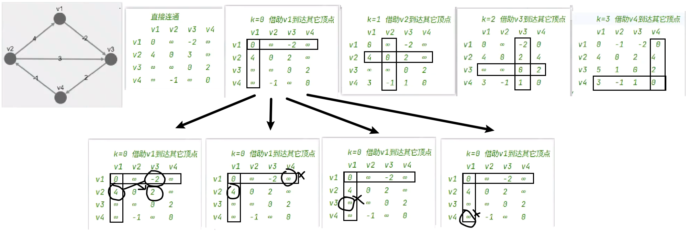

# 最短路径

**无权最短路径问题** 用 BFS 求解就行了。

下面都是**带权最短路径问题**

​	Dijkstra（单源）：贪心，处理所有顶点，但不处理所有边。不能处理负边。

​	Bellman-Ford（单源）：处理所有边。处理负边，但不能处理负环。

​	Floyd（多源）：处理所有顶点，嵌套。处理负边，但不能处理负环。


> 选择：

无负权边：Dijkstra；Bellman-ford、Floyd

单源多源：Dijkstra、Bellman-ford；Floyd

检测负环：只有Bellman-Ford。

## 2.1. Dijkstra


* Dijkstra贪心，出问题是因为认为本次已经找到了该顶点的最短路径，下次不会再处理它（cur.visited = true）。所有负边存在时，就不会再考虑它。
* 与之对比，Bellman-Ford 并没有考虑局部距离最小的顶点，而是每次都处理所有边，所以不会出错，当然效率不如 Dijkstra
### 2.1.1. 邻接矩阵
邻接矩阵 w + vis + dist

1. 为每个节点创建两个属性：访问和距离
   - 访问：将节点分为「未遍历节点」和「已遍历节点」，一开始所有节点都未访问。
   - 距离：起始节点的距离是0，其他都是INF
2. 选择未访问且距离最小的节点作为当前节点：
   - 松弛操作，更新对未访问过的相邻节点的距离：`dist[i] = min(dist[i], dist[cur] + w[cur][i])`
   - 标记当前节点为已访问（所以N个节点N轮）

```java
// 743. 网络延迟时间
class Solution {
    int N = 101;
    int[][] w = new int[N][N];
    boolean[] vis = new boolean[N];
    int[] dist = new int[N];
    final int INF = 0x3f3f3f3f;

    // 直接用k，第一个节点就是索引1.
    public int networkDelayTime(int[][] times, int n, int k) {
        // 权：注意题目中有些权为0
        for(int[] wi: w){
            Arrays.fill(wi, -1);
        }
        for (int[] time : times) {
            w[time[0]][time[1]] = time[2];
        }
        // 自身
        for (int i = 1; i <= n; i++) {
            w[i][i] = 0;
        }

        dijkstra(n, k);

        int max = 0;
        for (int i = 1; i <= n; i++) {
            max = Integer.max(max, dist[i]);
            if (max == INF) {
                return -1;
            }
        }
        return max;
    }

    public void dijkstra(int n, int k) {
        // 起始先将所有的点标记为「未更新」和「距离为正无穷」
        Arrays.fill(vis, false);
        Arrays.fill(dist, INF);
        // 让起始节点的dist为0
        dist[k] = 0;
        // n个节点n轮
        for (int p = 1; p <= n; p++) {
            // 当前节点：找出未遍历过且距离最小的节点。
            // 不用担心-1不会被更新，因为每一轮都会选择一个未访问的节点并设置为访问过
            int cur = -1;
            for (int i = 1; i <= n; i++) {
                // cur == -1：第一个未访问的节点不用比较就是cur，所以不能将cur赋值1再比较距离（因为它不一定是未访问的节点）。
                if (!vis[i] && (cur == -1 || dist[i] < dist[cur])) {
                    cur = i;
                }
            }
            // 更新当前节点的相邻节点的距离
            for (int i = 1; i <= n; i++) {
                // 有的权是0，不连接是-1
                if(!vis[i] && w[cur][i] >= 0){
                    dist[i] = Integer.min(dist[i], dist[cur] + w[cur][i]);
                }
            }
            // for (int i = 1; i <= n; i++) {
            //     if(!vis[i] && w[cur][i] >= 0 && dist[cur] + w[cur][i] < dist[i] ){
            //         dist[i] = dist[cur] + w[cur][i];
            //     }
            // }
            // 打上标记
            vis[cur] = true;
        }
    }
}
```
### 2.1.2. spa

```java
// 743. 网络延迟时间
class Solution {
    int N = 101;
    int M = 6001;
    static final int INF = 0x3f3f3f3f;
    // 边的编号：插入一条边就自增
    int idx = 1;
    // N节点，M边
    // 边→指向的节点
    int[] e = new int[M];
    // 起始节点→所对应的边链表的头结点的边编号；
    int[] he = new int[N];
    // 边→同一起始节点所对应的链表中的下一个边编号。
    int[] ne = new int[M];
    // 边的权重
    int[] w = new int[M];

    boolean[] vis = new boolean[N];
    int[] dist = new int[N];

    public void add_spa(int from, int to, int weight) {
        e[idx] = to;
        ne[idx] = he[from];
        he[from] = idx;
        w[idx] = weight;
        idx++;
    }

    // 直接用k，第一个节点就是索引1.
    public int networkDelayTime(int[][] times, int n, int k) {
        // 权：注意有些权为0
        for (int[] time : times) {
            add_spa(time[0], time[1], time[2]);
        }

        dijkstra(n, k);

        int max = 0;
        for (int i = 1; i <= n; i++) {
            max = Integer.max(max, dist[i]);
            if (max == INF) {
                return -1;
            }
        }
        return max;
    }

    public void dijkstra(int n, int k) {
        // 起始先将所有的点标记为「未更新」和「距离为正无穷」
        Arrays.fill(vis, false);
        Arrays.fill(dist, INF);
        // 让起始节点的dist为0
        dist[k] = 0;
        // 优先级队列存结点id和距离
        PriorityQueue<int[]> q = new PriorityQueue<>((a, b) -> a[1] - b[1]);
        q.offer(new int[] { k, dist[k] });
        // n个节点n轮
        while(!q.isEmpty()) {
            // 当前节点：找出未遍历过且距离最小的节点。
            int cur = q.poll()[0];
            // 更新当前节点的相邻节点的距离
            for (int i = he[cur]; i != 0; i = ne[i]) {
                int node = e[i];
                // spa的边是肯定相连的，所以不用判断权重 w>=0
                if (dist[cur] + w[i] < dist[node]) {
                    dist[node] = dist[cur] + w[i];
                    q.offer(new int[] { node, dist[node] });
                }
            }
            // 打上标记
            vis[cur] = true;
        }
    }
}
```


## 2.2. bellman-ford

edges + dist
1. 只需要每个节点添加dist：起始节点的距离是0，其他都是INF
2. 遍历每条边，松弛操作`dist[edge[1]] = Math.min(dist[edge[1]], dist[edge[0]] + edge[2])`
3. n个节点n - 1轮。

PS: 遍历每条边，只要全部遍历就行，没有特定顺序。哪怕每轮都打乱也行。
```java
// 743. 网络延迟时间
class Solution {
    int N = 101;
    int[] dist = new int[N];
    final int INF = 0x3f3f3f3f;

    // 直接用k，第一个节点就是索引1.
    public int networkDelayTime(int[][] times, int n, int k) {
        bellmanford(times, n, k);

        int max = 0;
        for (int i = 1; i <= n; i++) {
            max = Integer.max(max, dist[i]);
            if (max == INF) {
                return -1;
            }
        }
        return max;
    }

    public void bellmanford(int[][] edges, int n, int k) {
        Arrays.fill(dist, INF);
        // 让起始节点的dist为0
        dist[k] = 0;
        // n个节点n - 1轮
        for (int p = 1; p < n; p++) {
            // 每轮遍历边，更新dist
            for(int[] edge: edges){
                // if(dist[edge[1]] > dist[edge[0]] + edge[2]){
                //     dist[edge[1]] = dist[edge[0]] + edge[2];
                // }
                dist[edge[1]] = Math.min(dist[edge[1]], dist[edge[0]] + edge[2]);
            }
        }
    }
}
```

检测负环，就是再来一轮，如果还能更小，说明有负环。但是不知道具体位置。


## 2.3. floyd
基于w的二维dist 
1. 直接在邻接矩阵的基础上造二维dist：自身的距离是0，有链接是权重，不连接是INF
2. 遍历每个源节点和目标节点，松弛操作`dist[i][j] = Math.min(dist[i][j], dist[i][p] + dist[p][j])`
3. 重复n轮，每个节点都被当做中继节点。



```java
// 743. 网络延迟时间
class Solution {
    int N = 101;
    int[][] dist = new int[N][N];
    final int INF = 0x3f3f3f3f;

    public int networkDelayTime(int[][] times, int n, int k) {
        // 直接在邻接矩阵的基础上造二维dist
        for (int[] d : dist) {
            Arrays.fill(d, INF);
        }
        for (int[] time : times) {
            dist[time[0]][time[1]] = time[2];
        }
        for (int i = 1; i <= n; i++) {
            dist[i][i] = 0;
        }

        floyd(n, k);

        int max = 0;
        for (int i = 1; i <= n; i++) {
            max = Integer.max(max, dist[k][i]);
            if (max == INF) {
                return -1;
            }
        }
        return max;
    }

    public void floyd(int n, int k) {
        // n个中继节点则n轮
        for (int p = 1; p <= n; p++) {
            // 首节点
            for (int i = 1; i <= n; i++) {
                // 首节点是中继节点就跳过
                if (i == p)
                    continue;
                // 目标节点
                for (int j = 1; j <= n; j++) {
                    // 目标节点是中继节点就跳过
                    if (j == p)
                        continue;
                    // 因为用的0x3f3f3f3f，所以不担心溢出
                    dist[i][j] = Math.min(dist[i][j], dist[i][p] + dist[p][j]);
                }
            }
        }
    }
}
```