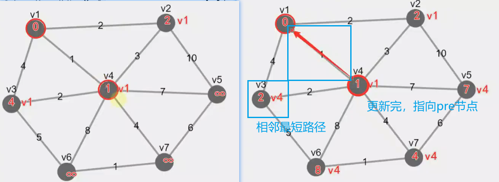
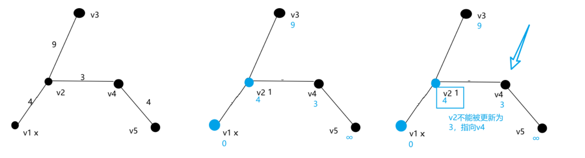
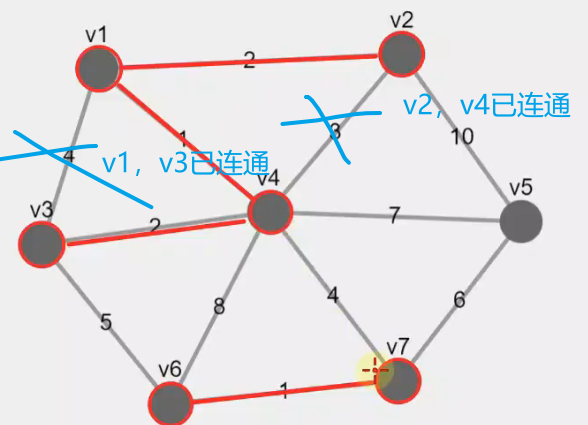

[toc]

Prim和Kruskal算法

- Prim遍历节点
- Kruskal遍历边

## Prim算法

和dijkstra算法相似：w + dist + vis + **pre**
- 不是到起始节点的累计路径，而是邻居距离（但不是最短的邻居距离，见图2）。
- 节点记录一个pre节点属性：谁更新邻居距离，pre节点就指向谁。
- 初始化：任选一个节点，它的邻居距离是0.
- 选取所有未遍历节点中最小的邻居距离的节点为当前顶点，更新当前顶点未遍历过的邻居节点的邻居距离，完成后连接当前节点和pre节点的路径为树枝、标记为已遍历过。





```java 
// 1584. 连接所有点的最小费用
class Solution {
    int[][] w;
    int[] dist;
    int[] pre;
    boolean[] vis;
    int INF = 0x3f3f3f3f;

    public int minCostConnectPoints(int[][] points) {
        int n = points.length;
        int N = n + 1;
        w = new int[N][N];
        dist = new int[N];
        pre = new int[N];
        vis = new boolean[N];
        for (int i = 0; i < n; i++) {
            for (int j = i + 1; j < n; j++) {
                w[i + 1][j + 1] = getDist(points, i, j);
                w[j + 1][i + 1] = getDist(points, i, j);
            }
        }
        prim(n);
        int cost = 0;
        for (int i = 1; i <= n; i++) {
            if (pre[i] == 0)
                continue;
            cost += w[i][pre[i]];
        }
        return cost;
    }

    public void prim(int n) {
        Arrays.fill(dist, INF);
        dist[1] = 0;
        for (int p = 1; p <= n; p++) {
            int cur = -1;
            for (int i = 1; i <= n; i++) {
                if (!vis[i] && (cur == -1 || dist[i] < dist[cur])) {
                    cur = i;
                }
            }
            for (int i = 1; i <= n; i++) {
                if (!vis[i] && w[cur][i] > 0 && w[cur][i] < dist[i]) {
                    dist[i] = w[cur][i];
                    pre[i] = cur;
                }
            }
            vis[cur] = true;
        }
    }

    public int getDist(int[][] points, int i, int j) {
        return Math.abs(points[i][0] - points[j][0]) + Math.abs(points[i][1] - points[j][1]);
    }
}
```

## Kruskal算法

遍历边：并查集
- 选择最小的边，连通头尾节点。
- 两节点已连通，才跳过。

PS：两节点已连通的判断，不能通过vis，两节点都已遍历过的情况还可能是孤立的两个图要连接。




```java
// 1584. 连接所有点的最小费用
class Solution {
    PriorityQueue<int[]> edges = new PriorityQueue<>((a, b) -> a[2] - b[2]);
    DisjointSetUnion dsn;
    List<int[]> result_edges = new ArrayList<>();
    int INF = 0x3f3f3f3f;

    public int minCostConnectPoints(int[][] points) {
        int n = points.length;
        dsn = new DisjointSetUnion(n);
        for (int i = 0; i < n; i++) {
            for (int j = i + 1; j < n; j++) {
                edges.offer(new int[] { i, j, getDist(points, i, j) });
            }
        }
        prim(n);
        int cost = 0;
        for (int[] edge : result_edges) {
            cost += edge[2];
        }
        return cost;
    }

    public void prim(int n) {
        while (result_edges.size() < n - 1) {
            int[] edge = edges.poll();
            int x = edge[0], y = edge[1], w = edge[2];
            if (dsn.union(x, y)) {
                result_edges.add(new int[] { x, y, w });
            }
        }
    }

    public int getDist(int[][] points, int i, int j) {
        return Math.abs(points[i][0] - points[j][0]) + Math.abs(points[i][1] - points[j][1]);
    }
}

class DisjointSetUnion {
    int n;
    int f[];
    int size[];

    public DisjointSetUnion(int n) {
        this.n = n;
        f = new int[n];
        for (int i = 0; i < n; i++) {
            f[i] = i;
        }
        size = new int[n];
        Arrays.fill(size, 1);
    }

    public int find(int x) {
        return x == f[x] ? x : (f[x] = find(f[x]));
    }

    public boolean union(int x, int y) {
        int fx = find(x), fy = find(y);

        if (fx == fy) {
            return false;
        } else {
            if (size[fx] < size[fy]) {
                size[fy] = size[fx] + size[fy];
                f[fx] = fy;
            } else {
                size[fx] = size[fx] + size[fy];
                f[fy] = fx;
            }
            return true;
        }
    }
}
```