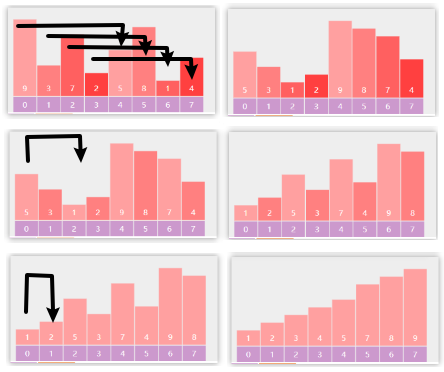

- 
- [3. 堆排序](#3-堆排序)
- [4. 插入排序](#4-插入排序)
- [5. 希尔排序](#5-希尔排序)
- [6. 归并排序](#6-归并排序)
  - [6.1. 递归：自顶向下](#61-递归自顶向下)
  - [6.2. 非递归实现：自底向上](#62-非递归实现自底向上)
  - [6.3. 递归实现+元素少时插入排序](#63-递归实现元素少时插入排序)
- [7. 快速排序](#7-快速排序)


---

```java
public void swap(int[] nums, int i, int j) {
    if(i == j) return;
    nums[i] = nums[i] ^ nums[j];
    nums[j] = nums[i] ^ nums[j];
    nums[i] = nums[i] ^ nums[j];
}
```


## 5. 希尔排序

插入排序改进：插入排序如果第一个元素是9，那么它要被移动n次；而希尔排序从大gap往小gap走，移动9的步幅很大，$\log_2 n$就足以。


* 根据步幅gap实现分组的插入排序
* 每轮排序后 gap 逐渐变小，直至 gap 为 1 完成排序 


```java
public int[] sortArray(int[] nums) {
    // gap 不断除2，直到1
    for (int gap = nums.length / 2; gap > 0; gap /= 2) {
        // 1替换为gap
        for (int low = gap; low < nums.length; low++) {
            int t = nums[low];
            int i = low - gap;
            while (i >= 0 && nums[i] > t) {
                nums[i + gap] = nums[i];
                i -= gap;
            }
            if (i != low - gap) {
                nums[i + gap] = t;
            }
        }
    }
    return nums;
}
```

## 6. 归并排序

### 6.1. 递归：自顶向下

```
[5,1,1,2,0,0]
[5,1,1] [2,0,0]     // 而自底向上是 [5,1] [1,2] [0,0]
[5,1] [1] [2,0] [0]
[5] [1] [1] [2] [0] [0]
```
```java
public int[] sortArray(int[] nums) {
    int[] t_arr = new int[nums.length];
    split(nums, 0, nums.length - 1, t_arr);
    return nums;
}

public void split(int[] nums, int left, int right, int[] t_arr) {
    if (left == right) {
        return;
    }
    // 分
    int m = (left + right) >>> 1;
    split(nums, left, m, t_arr);
    split(nums, m + 1, right, t_arr);
    // 并：结果存到临时数组里
    merge(nums, left, m, m + 1, right, t_arr);
    // 将临时数组里的结果拷回原数组
    System.arraycopy(t_arr, left, nums, left, right - left + 1);
}

public void merge(int[] nums, int iLeft, int iRight, int jLeft, int jRight, int[] t_arr) {
    int k = iLeft;  // 0在递归中可以，但为了和非递归保持一致。
    while (iLeft <= iRight && jLeft <= jRight) {
        if (nums[iLeft] < nums[jLeft]) {
            t_arr[k] = nums[iLeft];
            iLeft++;
        } else {
            t_arr[k] = nums[jLeft];
            jLeft++;
        }
        k++;
    }
    if (iLeft <= iRight) {
        System.arraycopy(nums, iLeft, t_arr, k, iRight - iLeft + 1);
    } else {
        System.arraycopy(nums, jLeft, t_arr, k, jRight - jLeft + 1);
    }
}
```

### 6.2. 非递归实现：自底向上

```
[5,1,1,2,0,0]
[5,1] [1,2] [0,0]   
[5,1,1,2] [0,0]     // 而自顶向下是 [5,1,1] [2,0,0]
[5,1,1,2,0,0]   
```
```java
public int[] sortArray(int[] nums) {
    int[] t_arr = new int[nums.length];
    split(nums, t_arr);
    return nums;
}

public void split(int[] nums, int[] t_arr) {
    int length = nums.length;
    // 宽度2，不断膨胀，直到一半能完全盖住数组前（要让左右还有的比较，不能让左边取完数组）
    for (int width = 2; width / 2 < length; width *= 2) {
        for (int left = 0; left < length; left += width) {
            int right = left + width - 1;
            int m = Math.min((left + right) >>> 1, length - 1);
            right = Math.min(right, length - 1);
            merge(nums, left, m, m + 1, right, t_arr);
        }
        System.arraycopy(t_arr, 0, nums, 0, length);
    }
}

public void merge(int[] nums, int iLeft, int iRight, int jLeft, int jRight, int[] t_arr) {
    int k = iLeft;
    while (iLeft <= iRight && jLeft <= jRight) {
        if (nums[iLeft] < nums[jLeft]) {
            t_arr[k] = nums[iLeft];
            iLeft++;
        } else {
            t_arr[k] = nums[jLeft];
            jLeft++;
        }
        k++;
    }
    if (iLeft <= iRight) {
        System.arraycopy(nums, iLeft, t_arr, k, iRight - iLeft + 1);
    } else {
        System.arraycopy(nums, jLeft, t_arr, k, jRight - jLeft + 1);
    }
}
```

### 6.3. 递归实现+元素少时插入排序

元素少时插入排序，是在分裂中，而不是一开始判断数组用归并还是分裂。

```java
class Solution {
    public int[] sortArray(int[] nums) {
        int[] t_arr = new int[nums.length];
        split(nums, 0, nums.length - 1, t_arr);
        return nums;
    }

    public void insertion(int[] nums, int left, int right){
        for(int low = left + 1; low <= right; low++){
            int t = nums[low];
            int i = low - 1;
            while(i >= left && nums[i] > t){
                nums[i + 1] = nums[i];
                i--;
            }
            if(i != low -1){
                nums[i + 1] = t;
            }
        }
    }

    public void split(int[] nums, int left, int right, int[] t_arr) {
        if (left == right) {
            return;
        }
        else if (right - left <= 32) {
            insertion(nums, left, right);
            return;
        }
        // 分
        int m = (left + right) >>> 1;
        split(nums, left, m, t_arr);
        split(nums, m + 1, right, t_arr);
        // 并：结果存到临时数组里
        merge(nums, left, m, m + 1, right, t_arr);
        // 将临时数组里的结果拷回原数组
        System.arraycopy(t_arr, left, nums, left, right - left + 1);
    }

    public void merge(int[] nums, int iLeft, int iRight, int jLeft, int jRight, int[] t_arr) {
        int k = iLeft;
        while (iLeft <= iRight && jLeft <= jRight) {
            if (nums[iLeft] < nums[jLeft]) {
                t_arr[k] = nums[iLeft];
                iLeft++;
            } else {
                t_arr[k] = nums[jLeft];
                jLeft++;
            }
            k++;
        }
        if (iLeft <= iRight) {
            System.arraycopy(nums, iLeft, t_arr, k, iRight - iLeft + 1);
        } else {
            System.arraycopy(nums, jLeft, t_arr, k, jRight - jLeft + 1);
        }
    }

    public void swap(int[] nums, int i, int j) {
        nums[i] = nums[i] ^ nums[j];
        nums[j] = nums[i] ^ nums[j];
        nums[i] = nums[i] ^ nums[j];
    }
}
```