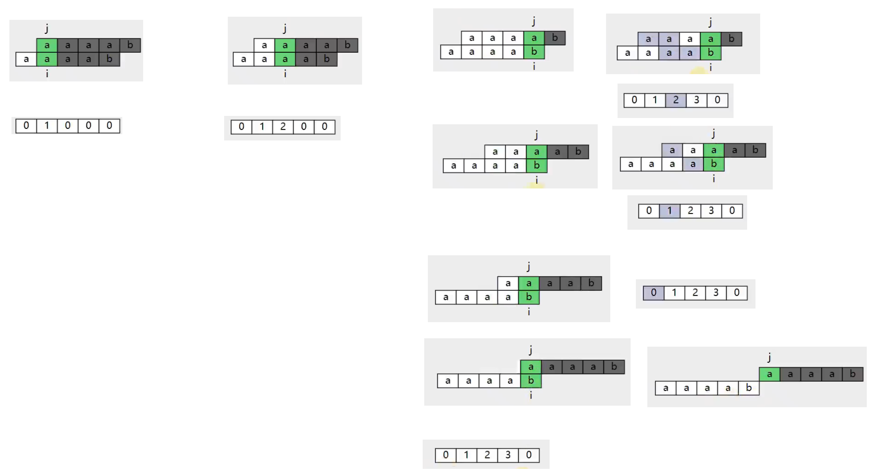
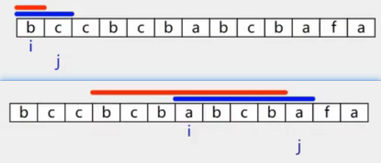

- [多个字符串的最长公共前缀](#多个字符串的最长公共前缀)
- [匹配子串](#匹配子串)
  - [暴力匹配](#暴力匹配)
  - [KMP](#kmp)
- [最长回文子串](#最长回文子串)
- [最小覆盖子串](#最小覆盖子串)


---
## 多个字符串的最长公共前缀
```java
// 14. 最长公共前缀
class Solution {
    public String longestCommonPrefix(String[] strs) {
        char[][] cs = new char[strs.length][];
        int minLen = strs[0].length();
        for (int i = 0; i < strs.length; i++) {
            cs[i] = strs[i].toCharArray();
            minLen = Math.min(minLen, cs[i].length);
        }
        char[] result = new char[minLen];
        int resultIdx = 0;
        for(int i = 0; i< minLen; i++){
            char c = cs[0][i];
            int j = 1;
            for(; j < cs.length; j++){
                if(c != cs[j][i]){
                    break;
                }
            }
            if(j == cs.length){
                result[resultIdx++] = c;
            }else{
                break;
            }
        }
        return new String(result, 0, resultIdx);
    }
}
```
## 匹配子串
### 暴力匹配
```java
// 28. 找出字符串中第一个匹配项的下标
class Solution {
    public int strStr(String haystack, String needle) {
        char[] c1 = haystack.toCharArray();
        char[] c2 = needle.toCharArray();

        int i = 0, j = 0;
        while (i < c1.length && j < c2.length) {
            if (c1[i] != c2[j]) {   
                i = i - j + 1;      // 不是直接i++
                j = 0;
            } else {
                i++;
                j++;
            }
        }
        if (j == c2.length) {
            return i - c2.length;
        } else {
            return -1;
        }
    }
}
```
### KMP



`j = lps[j-1]`

lps: 下标i处的值表示，i+1个字符的最长公共前缀的个数。

j前面有3个已匹配的字符，而3个已匹配的字符的最长公共前缀的个数，对应lps中就是下标2的值。

```java
class Solution {
    public int strStr(String haystack, String needle) {
        char[] origin = haystack.toCharArray();
        char[] pattern = needle.toCharArray();
        int[] lps = lps(pattern);

        int i = 0, j = 0;
        // while (i < origin.length) {
        while (pattern.length - j <= origin.length - i) {   // pattern剩余未匹配的要小于等于origin剩余未匹配的
            if (origin[i] == pattern[j]) {
                i++;
                j++;
            } else {
                if (j == 0) {
                    i++;
                } else {
                    j = lps[j - 1];
                }
            }
            if (j == pattern.length) {
                return i - j;
            }
        }
        return -1;
    }

    public int[] lps(char[] pattern) {
        int[] lps = new int[pattern.length];
        int i = 1, j = 0;
        while (i < pattern.length) {
            if (pattern[i] == pattern[j]) {
                lps[i] = j + 1;
                i++;
                j++;
            } else {
                if (j == 0) {
                    i++;
                } else {
                    j = lps[j - 1];
                }
            }
        }
        return lps;
    }
}
```

## 最长回文子串

检测方式：以下标i为圆心，向两边同步扩展。

两种回文：单个下标i开始，两个下标i和i+1开始。


```java
// 5.最长回文子串
class Solution {
    int left;
    int right;

    public String longestPalindrome(String s) {
        char[] cs = s.toCharArray();
        for (int i = 0; i < s.length(); i++) {
            extend(cs, i, i);
            if (i <= s.length() - 1)
                extend(cs, i, i + 1);
        }
        return new String(cs, left, right - left + 1);
    }

    public void extend(char[] cs, int i, int j) {
        while (i >= 0 && j < cs.length && cs[i] == cs[j]) {
            i--;
            j++;
        }
        // while超了，还原
        i++;
        j--;
        if (j - i > right - left) {
            left = i;
            right = j;
        }
    }
}
```

## 最小覆盖子串

```java
// 76.最小覆盖子串
class Solution {
    boolean flag;
    int left;
    int right;

    public String minWindow(String s, String t) {
        int[] scount = new int[128];
        int[] tcount = new int[128];

        char[] cs = s.toCharArray();
        char[] ct = t.toCharArray();

        int condition = 0;

        for (char c : ct) {
            tcount[c]++;
        }
        for (int c : tcount) {
            if (c > 0)
                condition++;
        }
        int i = 0;
        int j = 0;
        int tempCondition = 0;
        // 遍历j
        while (j < cs.length) {
            char cj = cs[j];
            scount[cj]++;
            if (scount[cj] == tcount[cj]) {
                tempCondition++;
            }
            // 缩小i：条件满足且i不超过j
            while (condition == tempCondition && i <= j) {
                if (!flag) {
                    left = i;
                    right = j;
                    flag = true;
                } else if (right - left > j - i) {
                    left = i;
                    right = j;
                }
                char ci = cs[i];
                scount[ci]--;
                if (scount[ci] < tcount[ci]) {
                    tempCondition--;
                }
                i++;
            }
            j++;
        }

        return flag ? new String(cs, left, right - left + 1) : "";
    }
}
```