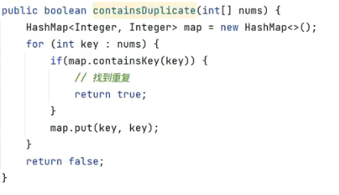

## 斐波那契数列



```java
// 循环
public static int fib(int n) {
    if (n <= 1) return n;
    // a, b 分别为第 n-2, n-1 项
    int a = 0, b = 1;
    int sum = 0;
    for (int i = 2; i <= n; i++) {
        sum = (a + b) % 1000000007;
        a = b;
        b = sum;
    }
    return sum;
}

// 递归
public static int fib2(int n) {
    if (n <= 1) return n;
    return fib2(n - 1) + fib2(n - 2);
}
```