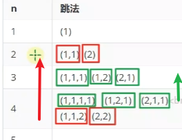

- 数组引用的数组：32 个字节，其中 array[0]，array[1]，array[2] 三个元素分别保存了指向三个一维数组的引用
- 三个实际元素的数组各占 40 个字节
- 它们在内层布局上是**连续**的


> 已知 array **对象**起始地址是 0x1000，那么 23 这个元素的地址是什么？
>
> ```java
> byte[][] array = {
>     {11, 12, 13, 14, 15},
>     {21, 22, 23, 24, 25},
>     {31, 32, 33, 34, 35},
> };
> ```
> 
>  答：
> * 起始地址 0x1000
> * 外层数组大小：16字节对象头 + 3元素 * 每个引用4字节 + 4 对齐字节 = 32 = 0x20
> * 第一个内层数组大小：16字节对象头 + 5元素 * 每个byte1字节 + 3 对齐字节 = 24 = > 0x18
> * 第二个内层数组，16字节对象头 = 0x10，待查找元素索引为 2
> * 最后结果 = 0x1000 + 0x20 + 0x18 + 0x10 + 2*1 = 0x104a


### 4) 局部性原理


```java
public static void ij(int[][] a, int rows, int columns) {
    // ij 方法
    for (int i = 0; i < rows; i++) {
        for (int j = 0; j < columns; j++) {
            sum += a[i][j];
        }
    }
    // ji 方法
    for (int j = 0; j < columns; j++) {
        for (int i = 0; i < rows; i++) {
            sum += a[i][j];
        }
    }
}
```

> 可以看到 ij 的效率比 ji 快很多，为什么呢？

局部性原理:
- cpu 读取内存（速度慢）数据后，会将其放入高速缓存（速度快）当中，如果后来的计算再用到此数据，在缓存中能读到的话，就不必读内存了
- 缓存的最小存储单位是缓存行（cache line），一般是 64 bytes。缓存是有限的，当新数据来了后，一些旧的缓存行数据就会被覆盖，如果不能充分利用缓存的数据，就会造成效率低下
- ij 函数则能充分利用局部性原理加载到的缓存数据，而ji则浪费。

---
Java自带数组就是静态数组，创建时容量就固定死了，不能删除和插入。

Java实现好的动态数组就是ArrayList。

- 删除会涉及后面的元素前移。
- 插入会涉及扩容（创建新数组，复制旧数组。。）


`Arrays.copyOfRange`的to，包含吗？

## 实现动态数组
```java
import java.util.Arrays;
import java.util.Iterator;
import java.util.function.Consumer;
import java.util.stream.IntStream;

public class DynamicArray implements Iterable<Integer> {
    private int size = 0; // 逻辑大小，已有几个元素
    private int capacity = 8; // 容量
    private int[] array = {};

    /**
     * 向最后位置 [size] 添加元素
     *
     * @param element 待添加元素
     */
    public void addLast(int element) {
        array[size] = element;
        size++;
        // add(size, element);
    }

    /**
     * 向 [0 .. size] 位置添加元素
     *
     * @param index   索引位置
     * @param element 待添加元素
     */
    public void add(int index, int element) {
        checkAndGrow();
        // 添加逻辑
        if (index >= 0 && index < size) {
            // 向后挪动, 空出待插入位置，个数刚好是 size - index
            System.arraycopy(array, index, array, index + 1, size - index);
        }
        array[index] = element;
        size++;
    }

    private void checkAndGrow() {
        // 容量检查
        if (size == 0) {
            array = new int[capacity];
        } else if (size == capacity) {
            // 进行扩容, 1.5 倍
            capacity += capacity >> 1;
            int[] newArray = new int[capacity];
            System.arraycopy(array, 0, newArray, 0, size);
            array = newArray;
        }
    }

    /**
     * 从 [0 .. size) 范围删除元素
     *
     * @param index 索引位置
     * @return 被删除元素
     */
    public int remove(int index) { // [0..size)
        int removed = array[index];        
        if (index < size - 1) {
            // 向前挪动, 移动size - index - 1个
            System.arraycopy(array, index + 1,
                    array, index, size - index - 1);
        }
        size--;
        return removed;
    }

    /**
     * 查询元素
     *
     * @param index 索引位置, 在 [0..size) 区间内
     * @return 该索引位置的元素
     */
    public int get(int index) {
        return array[index];
    }

    /**
     * 遍历方法1
     *
     * @param consumer 遍历要执行的操作, 入参: 每个元素
     */
    public void myforEach(Consumer<Integer> consumer) {
        for (int i = 0; i < size; i++) {
            consumer.accept(array[i]);
        }
        /*
         * dynamicArray.myforEach((element))->{
         *      System.out.println(element);
         * }
         */
    }

    /**
     * 遍历方法2 - 迭代器遍历
     */
    @Override
    public Iterator<Integer> iterator() {
        return new Iterator<Integer>() {
            int i = 0;

            @Override
            public boolean hasNext() { // 有没有下一个元素
                return i < size;
            }

            @Override
            public Integer next() { // 返回当前元素,并移动到下一个元素
                return array[i++];
            }
        };
        /*
         * for(Integer element: dynamicArray){
         *      System.out.println(element);
         * }
         */
    }
    
    /**
     * 遍历方法3 - stream 遍历
     *
     * @return stream 流
     */
    public IntStream stream() {
        assert
        return IntStream.of(Arrays.copyOfRange(array, 0, size));

        /*
         * dynamicArray.stream().forEach((element))->{
         *      System.out.println(element);
         * }
         */
    }
}
```

> 获取`get()`性能

O(1)

> 插入或删除性能

头部位置、中间位置，时间复杂度是 $O(n)$

尾部位置，时间复杂度是 $O(1)$（扩容很罕见，均摊来说）

## 二维数组

