## 二叉查找树
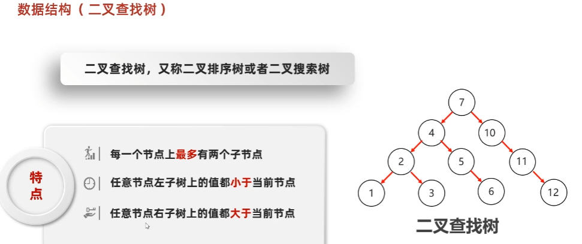

弊端：
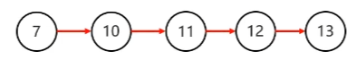

## 平衡二叉树

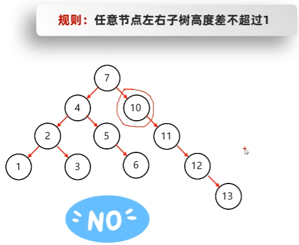

双左则右，左右则左右：
- 左左：一次右旋
- 左右：一次子树左旋，一次右旋
- 右右：一次左旋
- 右左：一次子树右旋，一次左旋

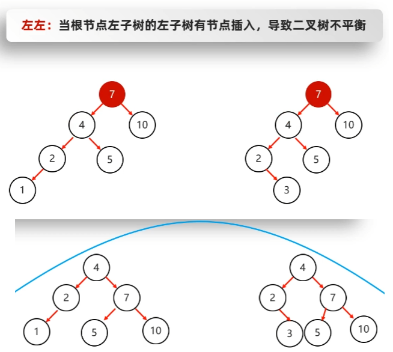

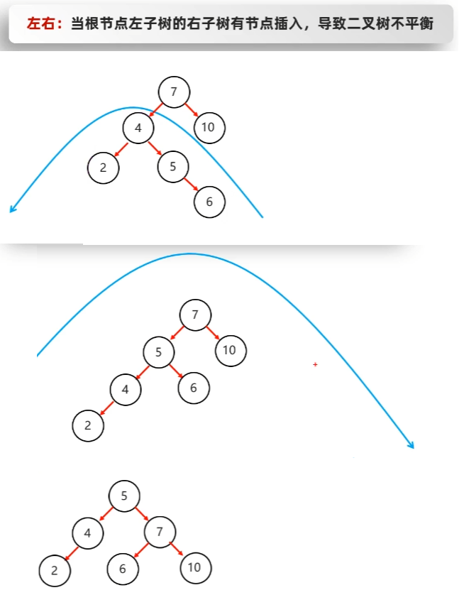

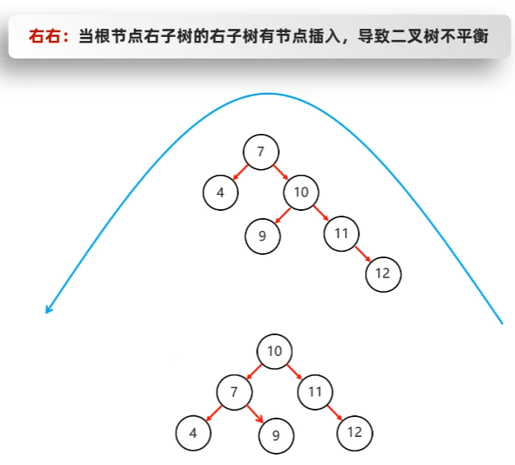

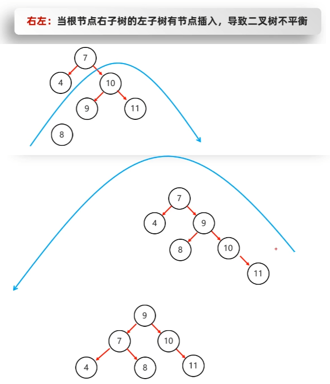

### 旋转机制

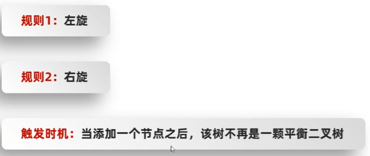

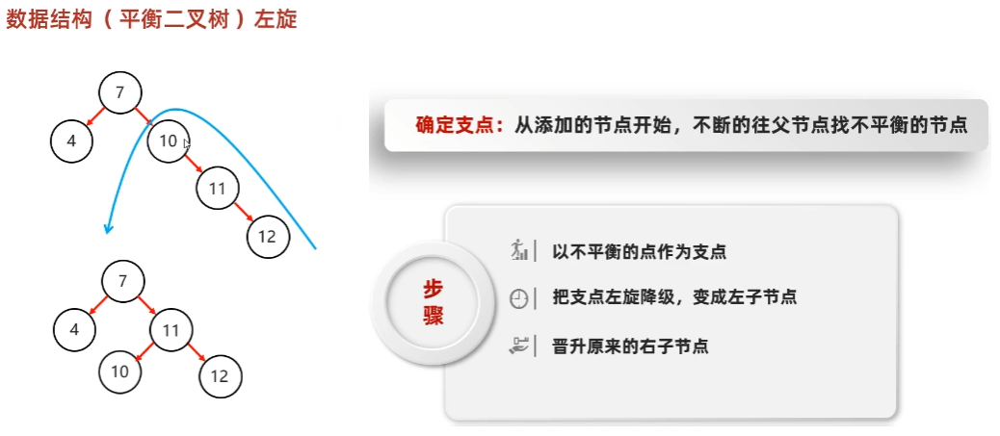

#### 左旋

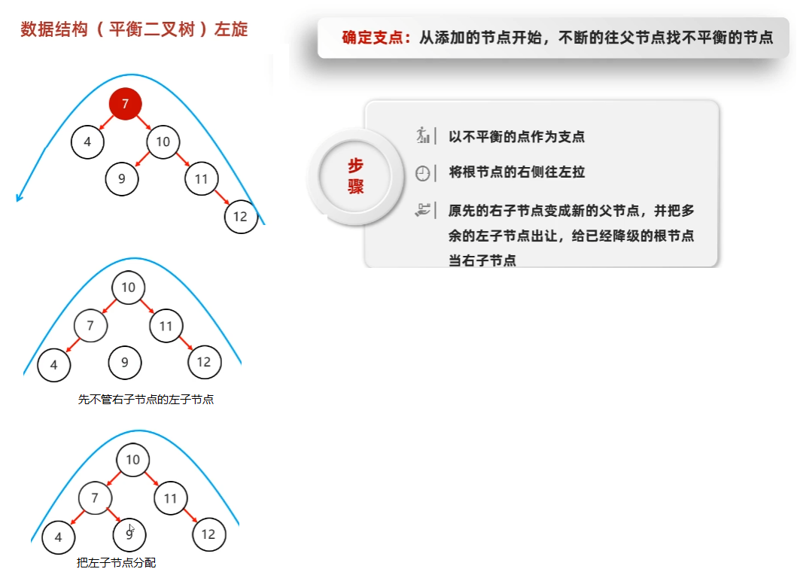

#### 右旋转

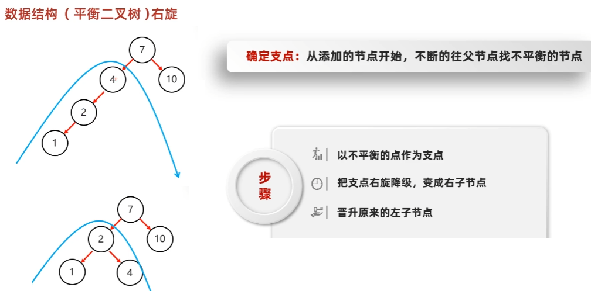

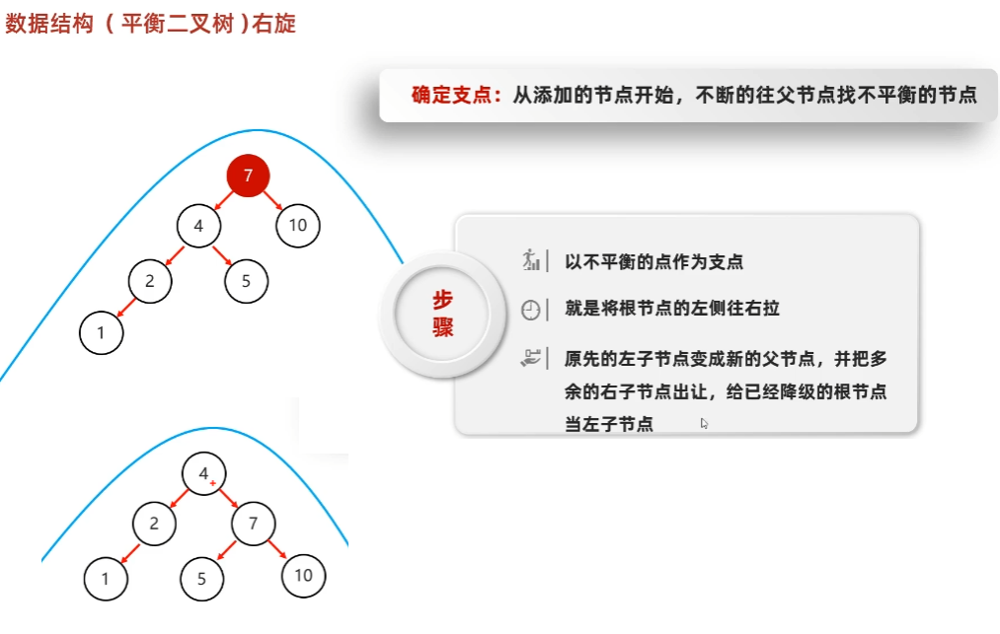

## 红黑树(平衡二叉B树)

增删改查性能都很好。

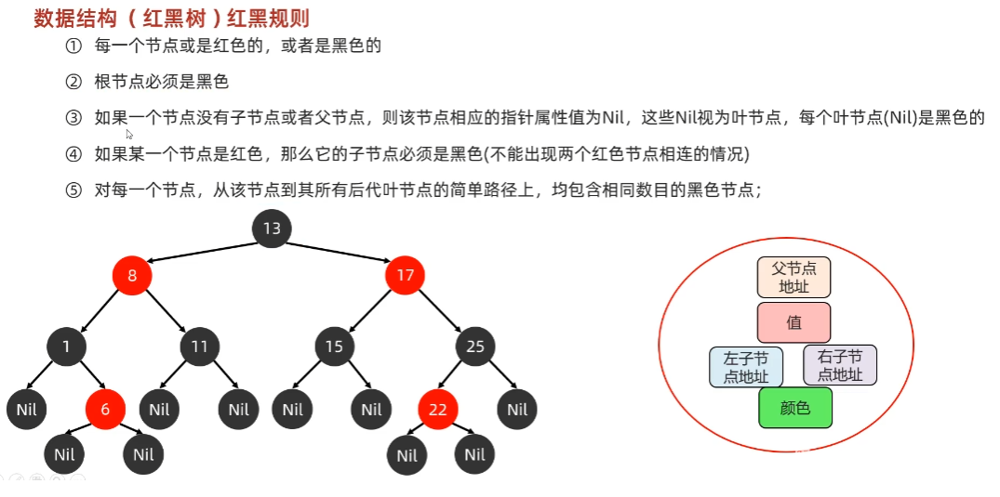

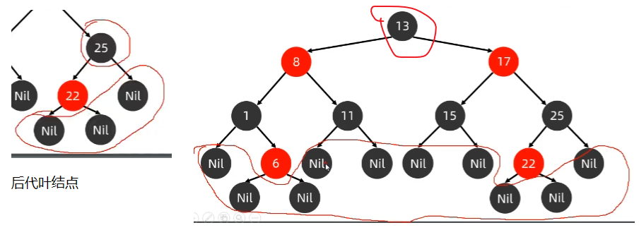

### 添加结点

默认颜色:添加节点默认是红色的(效率高)

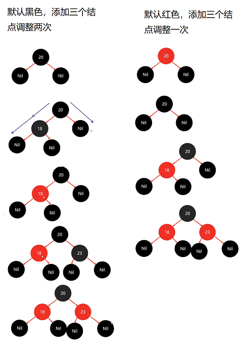

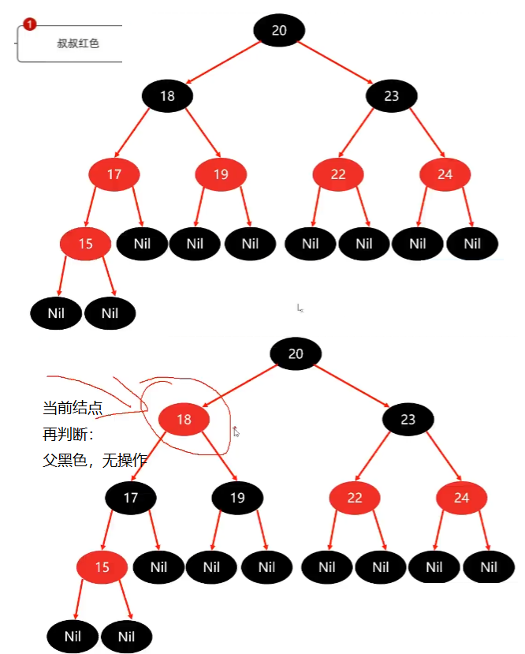

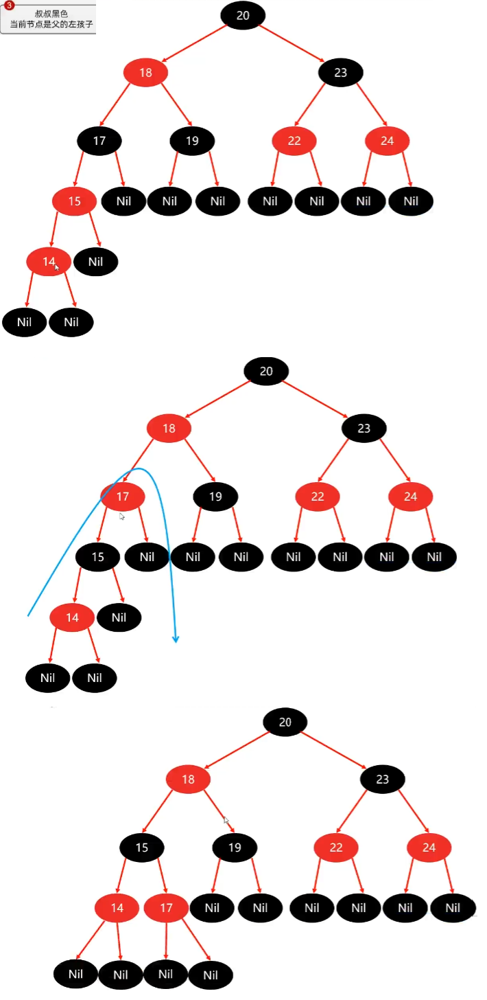