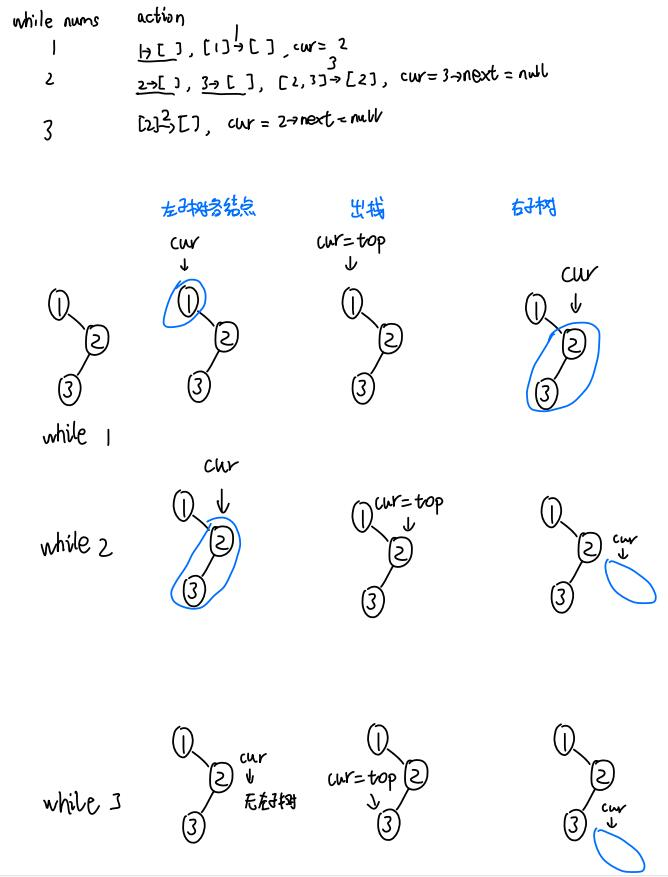
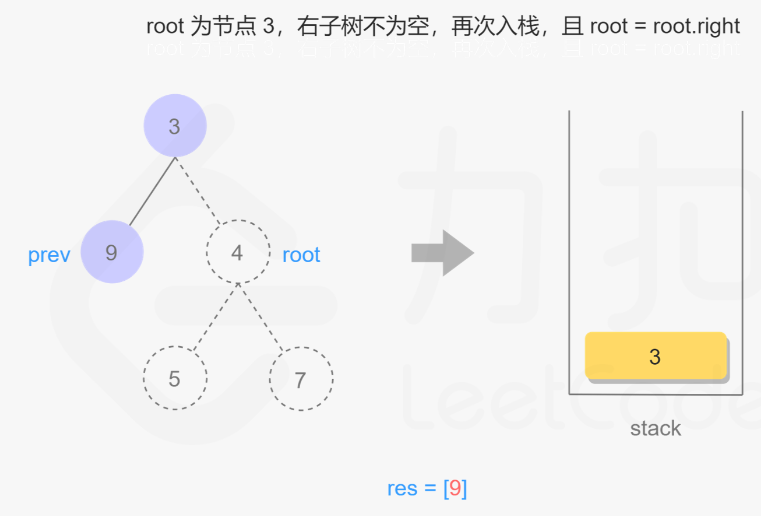

- [1. 结点定义](#1-结点定义)
- [2. 前序遍历](#2-前序遍历)
  - [2.1. 递归](#21-递归)
  - [2.2. 迭代](#22-迭代)
  - [2.3. Morris 遍历](#23-morris-遍历)
- [3. 前、中、后](#3-前中后)
- [4. 后序遍历](#4-后序遍历)

---

# 1. 结点定义
```cpp
struct TreeNode {
    int val;
    TreeNode *left;
    TreeNode *right;
    TreeNode() : val(0), left(nullptr), right(nullptr) {}
    TreeNode(int x) : val(x), left(nullptr), right(nullptr) {}
    TreeNode(int x, TreeNode *left, TreeNode *right) : val(x), left(left), right(right) {}
};
```

# 2. 前序遍历

## 2.1. 递归

```
示例 1：
输入：root = [1,null,2,3]
输出：[1,2,3]

示例 2：
输入：root = []
输出：[]

示例 3：
输入：root = [1]
输出：[1]
```
```cpp
class Solution {
public:
    void preorder(TreeNode *root, vector<int> &res) {
        if (root == nullptr) {
            return;
        }
        res.emplace_back(root->val);
        preorder(root->left, res);
        preorder(root->right, res);
    }

    vector<int> preorderTraversal(TreeNode *root) {
        vector<int> res;
        preorder(root, res);
        return res;
    }
};
```
判断根节点是否为nullptr，这是递归退出的条件。不管左右中序遍历，判断nullptr都是写在最前面。

> 复杂度：

时间复杂度：O(n)，其中 n 是二叉树的节点数。每一个节点恰好被遍历一次。

空间复杂度：O(n)，为递归过程中栈的开销，平均情况下为 $O(\log n)$，最坏情况下树呈现链状，为 O(n)。


## 2.2. 迭代

```cpp
class Solution {
public:
    vector<int> preorderTraversal(TreeNode* root) {
        vector<int> res;
        if (root == nullptr) {
            return res;
        }

        stack<TreeNode*> stk;
        TreeNode* cur = root;
        while (!stk.empty() || cur != nullptr) {
            while (cur != nullptr) {
                res.emplace_back(cur->val);
                stk.emplace(cur);
                cur = cur->left;
            }
            cur = stk.top();
            stk.pop();
            cur = cur->right;
        }
        return res;
    }
};
```

递归的时候隐式地维护了一个栈，而我们在迭代的时候需要显式地将这个栈模拟出来。

- 每次循环干三件事，
  ①左子树处理：将当前结点和其下的所有直接左结点入栈，最后当前结点是最左结点。
  ②出栈顶：当前元素为栈顶，并弹出。
  ③右子树处理：为下一次循环分配右子树，将栈顶元素的右孩子作为当前结点，即右子树的根结点是栈顶的右孩子。
  
  
- 入栈的同时，就输出该值。
- 退出循环的条件是，栈是空的，并且右子树结点为空（比如，根节点有左右子树，轮到根节点的右孩子时（即while2一开始时），栈是空的）。

> 误区


结点遍历的方法成最后非空那种，就特别麻烦。
```cpp  
class Solution {
public:
    vector<int> preorderTraversal(TreeNode* root) {
        vector<int> res;

        if(root == nullptr){
            return res;
        }
        
        stack<TreeNode*> stk;
        TreeNode * cur = root;
        stk.emplace(cur);
        res.emplace_back(cur->val);

        while(!stk.empty()){
            while(cur != nullptr && cur->left !=nullptr){
                stk.push(cur->left);
                cur = cur->left;
                res.emplace_back(cur->val);
            }

            cur = stk.top();
            stk.pop();
            cur = cur->right;

            if(cur != nullptr){
                stk.push(cur);
                res.emplace_back(cur->val);
            }
        }
        return res;
    }
};
```

## 2.3. Morris 遍历

[没学](https://leetcode.cn/problems/binary-tree-preorder-traversal/solution/er-cha-shu-de-qian-xu-bian-li-by-leetcode-solution/)

# 3. 前、中、后

递归：永远是先左后右，根据前中后调整根的位置
- 前：根、左、右
- 中：左、根、右
- 后：左、右、根

迭代：调整多会输出
- 前：入栈时（左子树时）
- 中：出栈时（根）
- 后：右子树时+特殊结构

# 4. 后序遍历

```cpp
class Solution {
public:
    vector<int> postorderTraversal(TreeNode* root) {
        vector<int> res;
        if(root == nullptr){
            return res;
        }

        stack<TreeNode*> stk;
        TreeNode* cur = root;
        TreeNode* pre = nullptr;
        while(!stk.empty() || cur != nullptr){
            while(cur != nullptr){
                stk.emplace(cur);
                cur = cur->left;
            }
            cur = stk.top();
            stk.pop();
            // 右孩子不为空，且右子树没被走过时
            // 重新入栈，cur = cur->right，
            if(cur->right != nullptr && cur->right != pre){
                stk.emplace(cur);
                cur = cur->right;
            }
            // 右孩子为空时，或重复右子树
            // 输出，标记，
            else{
                res.emplace_back(cur->val);
                pre = cur;
                cur = nullptr;
            }
            
        }
        return res;
    }
};
```
右子树情况：
- 没有右子树，那`cur = cur->right = nullptr`，所以直接是`cur = nullptr`.
- 未被走过的非空右子树，根结点（指小子树的根，而不是整棵树）重新入栈，这样让右孩子先于根结点，实现后序遍历的 左-右-根 效果。
- 走过的非空右子树，那就不该`cur = cur->right`，所以让它置空`cur = nullptr`。


- 重新入栈：
  右孩子不为空时，且右子树没被走过。
  已经pop弹出的结点3，会重新入栈。
  

- 标记更新：
  - 右孩子为空直接输出的情况
  - 或者是重复右子树，
