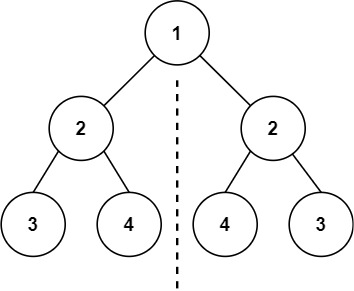
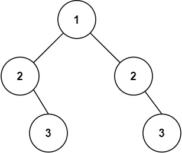

给你一个二叉树的根节点 root ， 检查它是否轴对称。

 
> 示例 1：

  

输入：root = [1,2,2,3,4,4,3]
输出：true
> 示例 2：


输入：root = [1,2,2,null,3,null,3]
输出：false
 
  

提示：

树中节点数目在范围 `[1, 1000]` 内
`-100 <= Node.val <= 100`


```cpp
class Solution {
public:
    bool isSymmetric(TreeNode* root) {
        if(root == nullptr){
            return true;
        }

        queue<TreeNode*> q;
        q.emplace(root);

        while(!q.empty()){
            int n = q.size();
            vector<int> level;
            for(int i = 0 ; i < n; i++){
                TreeNode * cur = q.front();
                q.pop();
                if(cur->left){
                    q.emplace(cur->left);
                    level.emplace_back(cur->left->val);
                }else{
                    level.emplace_back(999);
                }
                if(cur->right){
                    q.emplace(cur->right);
                    level.emplace_back(cur->right->val);
                }else{
                    level.emplace_back(999);
                }
            }
            for(int i = 0 , j = level.size() - 1 ; i < j ; i++, j--){
                if(level[i] != level[j]){
                    return false;
                }
            }
        }
        return true;
    }
};
```

我们将叶子结点的null孩子的val记作999，层序遍历打印出来，for循环首尾对称对比。
```
// root = [1,2,2,null,3,null,3]
2 2 
999 3 999 3 
```