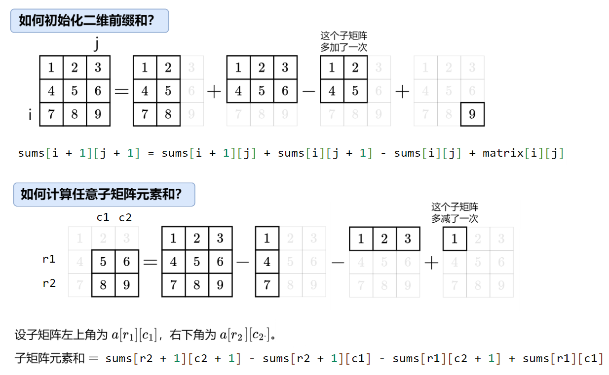

- [一维](#一维)
- [二维](#二维)
- [leetcode](#leetcode)

---

## 一维

> 前缀和

对于数组 nums，定义它的前缀和 
- $nums[0]=0$
- $nums[i+1] = \sum\limits_{j=0}^{i}\textit{nums}[j]$。

根据这个定义，有 sums[i+1]=sums[i]+nums[i]

例如 nums=[1,2,1,2]，对应的前缀和数组为 sums=[0,1,3,4,6]。

sums[i]表示[0...i-1]的子数组的和，sums[0]=0 表示一个空数组的元素和。

> 前缀和之差

把子数组的元素和转换成两个前缀和的差，即

`[left...right] = sums[right + 1] - sums[left]`

$$\displaystyle \sum_{j=left}^{right}\textit{nums}[j] = sums[right+1] - sums[left] = \sum\limits_{j=0}^{right} \textit{nums}[j] - \sum\limits_{j=0}^{left-1}\textit{nums}[j] $$


问：为什么要定义 sums[0]=0，这样做有什么好处？

答：如果要计算的子数组是`[0...j]`，那么就是sums[j+1]-sums[0]。如果不定义 sums[0]=0，就必须特判 left=0 的情况了。

```java
// 303. 区域和检索 - 数组不可变
class NumArray {
    int[] sums;

    public NumArray(int[] nums) {
        sums = new int[nums.length + 1];
        sums[0] = 0;
        for (int i = 0; i < nums.length; i++) {
            sums[i + 1] = sums[i] + nums[i];
        }
    }

    public int sumRange(int left, int right) {
        return sums[right + 1] - sums[left];
    }
}
```
## 二维

```java
// 304. 二维区域和检索 - 矩阵不可变
class NumMatrix {
    int[][] sums;

    public NumMatrix(int[][] matrix) {
        int m = matrix.length;
        int n = matrix[0].length;
        sums = new int[m + 1][n + 1];
        for (int i = 0; i < m; i++) {
            for (int j = 0; j < n; j++) {
                sums[i + 1][j + 1] = sums[i + 1][j] + sums[i][j + 1] - sums[i][j] + matrix[i][j];
            }
        }
    }

    // 返回左上角在 (r1,c1) 右下角在 (r2,c2) 的子矩阵元素和
    public int sumRegion(int r1, int c1, int r2, int c2) {
        return sums[r2 + 1][c2 + 1] - sums[r2 + 1][c1] - sums[r1][c2 + 1] + sums[r1][c1];
    }
}
```

## leetcode

[2602. 使数组元素全部相等的最少操作次数](../leetcode/2602.%20使数组元素全部相等的最少操作次数.md)

[560. 和为 K 的子数组](../leetcode/560.%20和为K的子数组.md)