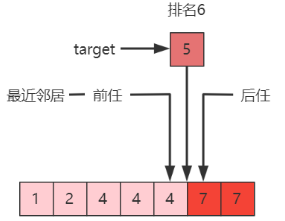

- [1. 二分查找](#1-二分查找)
  - [1.1. （重要）基础版：ij都查](#11-重要基础版ij都查)
  - [1.2. 改动版：查i不查j](#12-改动版查i不查j)
  - [1.3. 平衡版：查i不查j的平衡](#13-平衡版查i不查j的平衡)
  - [1.4. （重要）Leftmost 与 Rightmost的标准版](#14-重要leftmost-与-rightmost的标准版)
  - [1.5. （重要）Leftmost 与 Rightmost 的替身版](#15-重要leftmost-与-rightmost-的替身版)
  - [1.6. 递归版](#16-递归版)

---
## 1. 二分查找

target < a[m] < target，target在两边。

1. 基础版和改动版：区别就是左闭右闭、左闭右开。

     - j = n -1 , j = n
     - while(i<=j), while(i<j)
     - j = m- 1, j = m

2. 基础版的复杂度

    时间复杂度
    * 最坏情况：$O(\log n)$
    * 最好情况：如果待查找元素恰好在数组中央，只需要循环一次 $O(1)$
    
    空间复杂度
    * 需要常数个指针 $i,j,m$，因此额外占用的空间是 $O(1)$ 

3. leftmost和rightmost的标准版：找不到返回-1

    - leftmost: 找到了往左移， j = m - 1
    - rightmost: 找到了往右移， i = m + 1
4. leftmost和rightmost的替身版：找不到返回替身

    - leftmost：大于等于的最左 `target <= a[m]`, i
    - rightmost：小于等于的最右 `a[m] <= target`，i-1

### 1.1. （重要）基础版：ij都查 


> 原理

i和j所在的元素都被查，则：
- 首尾元素都被查。`int i = 0, j = a.length - 1;`

    ```java
           i                 j
    value: 2 12 18 23 45 54 65
    ```
- 中间元素m：刚好就直接return；目标元素在中间元素m左边，则要移动右游标j；目标元素在中间元素m右边，则要移动左游标i。因为i和j所在的元素都被查，中间元素m又已经被比较过了，所以直接放到待查的新元素上 `j=m-1`,`i=m+1`。
- 临界条件：`where(i<=j)`，因为i和j所在的元素都被查，所以需要`==`
- 向左查找, 比较次数少, 向右查找, 比较次数多

    ```
    //普通轮
    刚好要查12的情况，那么直接return
            m       
            i  j  
    value: 12  23 
    index:  3  4  

    //最后一轮
    刚好是12，那么直接return
    还不是，那么再经过i右移或j左移的操作，就该结束了
    
            m          
            i             i             i
            j          j             j
    value: 12    →    12                12
    index:  3          3                3
    ```
> 优化

1. `int m = (i+j)/2` → `int m = (i + j) >>> 1`
   
   两个大int的i、j相加会超int值，最终得到负数的m。

   而使用右移运算符则可以解决。

2. `return -1;` → 如果目标值不存在于数组中，返回它将会被按顺序插入的位置。
   
   - → `return i;`

        直接就是将会被按顺序插入的位置（插入到已有元素位置，则让当前元素后移；插入到数组外位置）。
   - → `return -(i + 1);`

        `插入位置 = 返回值+1后再取负`（其实就是还原i）。

        之所以用负数表示，是因为插入到负0和查找的正0的混淆，所以 + 1 再取负就是负1.
### 1.2. 改动版：查i不查j
i所在的元素都被查，j则不查（j是右边界，左边的才会被查），则
- 首元素被查，尾元素的next边界。`int i = 0, j = a.length;`

    ```java
           i                    j
    value: 2 12 18 23 45 54 65
    ```
- 中间元素m：因为i所在的元素都被查，`i=m+1`；而j所在的不查，左边的才要被查，所以就放在已经比较过的中间元素m处，`j=m;`
- 临界条件：`while (i < j)`

    ```
    //最后一轮
    刚好要查12的情况，那么直接return
            m         
            i  j  
    value: 12  23 
    index:  3  4  

    还不是，则i右移或j移动到m处就这样，j所在的元素不查，那么就该退出 i<j 没有等于
            i  
            j  
    value: 12  
    index:  3  
    ```

### 1.3. 平衡版：查i不查j的平衡


> 原理

不奢望循环内通过 m 找出目标, 缩小区间直至剩 1 个, 剩下的这个可能就是要找的。

将判断相等的操作移动到外面，else就表示大于等于的情况（target在中间索引m的位置或右边），而i索引的位置要被查，就`i=m`；
```java
       i                    j
value: 2 12 18 23 45 54 65


// 退出条件：i和j相邻，确定了唯一一个元素。
            i   j
value: 2 12 18 23 45 54 65
```

> 性能

- 三分支改为二分支, 循环内的平均比较次数减少了（原本在target在中间索引右边的话，要比较两次；现在只比较一次）。
- 但是如果待查找元素恰好在数组中央，就不像原来只需要循环一次，而是要循环到只剩一个元素。
- 时间复杂度就没有最好最坏，都是查到只剩一个元素： $\Theta(log(n))$

### 1.4. （重要）Leftmost 与 Rightmost的标准版

返回的是最左侧的重复元素 / 返回的是最右侧的重复元素，没找到则返回-1.


leftmost：本来中间索引m处找到了，但是还往左找（移动j向左 `j = m - 1`）
  
- 找18
    ```java
           m
           i   j  
    value: 18 18        找到了，记录
           
                i
            j
    value:      18 18 
    ```
- 找19
    ```java
           m
           i   j  
    value: 18 19 

                m
                i
                j
    value: 18  19       找到了，记录
    
                i
            j
    value: 18  19
    ```
    ```java
           i   m  j  
    value: 18 19 20     找到了，记录

            m
            i
            j
    value: 18 19  
    
               i
            j
    value: 18 19
    ```

### 1.5. （重要）Leftmost 与 Rightmost 的替身版

对于 Leftmost 与 Rightmost，可以返回一个比 -1 更有用的值，索引。

1. 简化：不用记录`candidate`，则直接去掉`candidate = m; // 记录候选位置`这一行。剩下`i = m + 1;`可以合并到上面的if-else中。
2. return 返回的含义变化：leftmost 找到大于等于目标的最左元素 `return i`，rightmost 找到小于等于目标的最右元素 `return i-1`
```java
// leftmost：找到大于等于目标的最左元素的索引

找 18
        j  i
value: 12 18 18

找 15
        j  i
value: 12 18 18
```

```java
// rightmost：找到小于等于目标的最右元素的索引
// PS: 如果返回i，那就是找到大于目标的最左元素


找 18
              j  i
value: 12 18 18 23

找 19
              j  i
value: 12 18 18 23
```

> 应用




**求前任（predecessor）**：`leftmost(target) - 1`，-1是前一个的索引

* 存在，`leftmost(4) - 1 = 1`，前任 $a_1 = 2$
* 不存在，`leftmost(3) - 1 = 1`，前任 $a_1 = 2$

**求后任（successor）**：`rightmost(target) + 1`

* 存在，`rightmost(4) + 1 = 5`，后任 $a_5 = 7$
* 不存在，`rightmost(5) + 1 = 5`，后任 $a_5 = 7$


**求排名**：`leftmost(target) + 1`，+1是从 0-based 索引到 1-based 第几

* $target$ 存在，如：`leftmost(4)+1 = 3`
* $target$ 不存在，如：`leftmost(5)+1 = 6`


**范围查询**：

* 查询 $x \lt 4$，`[0，前任], 即[0, leftmost(4) - 1]`
* 查询 $x \leq 4$，`[0, rightmost(4)]`
* 查询 $x > 4$，`[后任，∞], 即[rightmost(4) + 1, \infty]`
* 查询 $x \geq 4$， `[leftmost(4) , \infty]`
* 查询 $4 \leq x \leq 7$，`[leftmost(4) , rightmost(7)]`
* 查询 $4 \lt x \lt 7$，`[rightmost(4)+1 , leftmost(7)-1]`

**求最近邻居**：

* 前任和后任距离更近者

### 1.6. 递归版

拆解 while 循环。