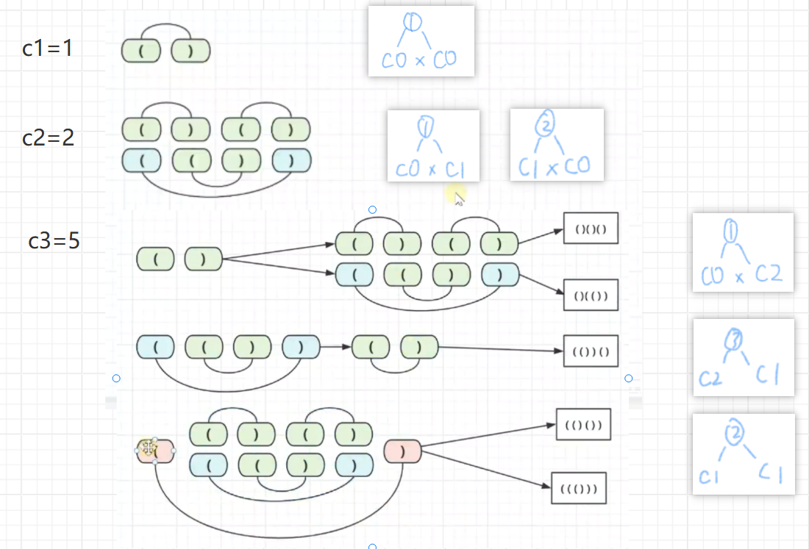
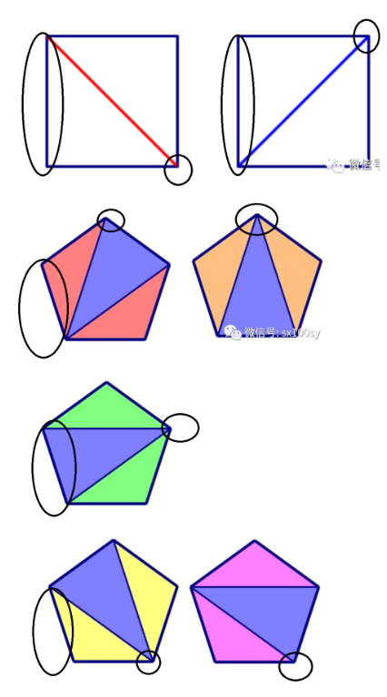
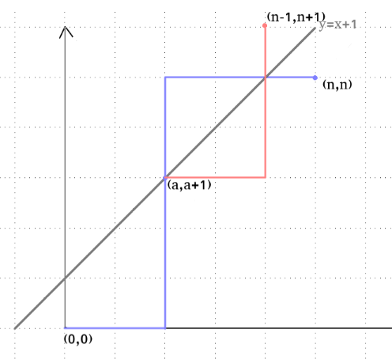
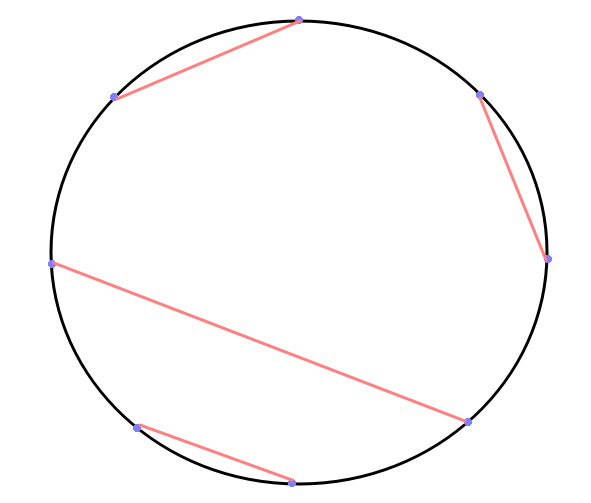
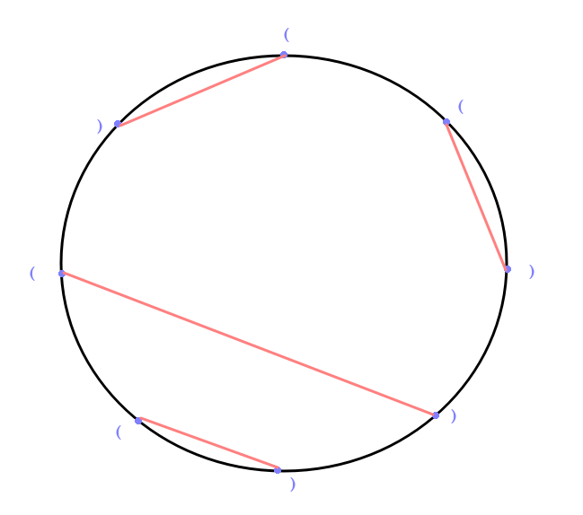
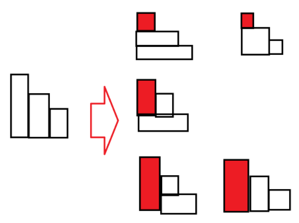

- [1. 不同的二叉搜索树](#1-不同的二叉搜索树)
- [2. 括号生成](#2-括号生成)
- [3. 出栈方案](#3-出栈方案)
- [4. 凸多边形的三角划分](#4-凸多边形的三角划分)
- [5. 合法路径](#5-合法路径)
- [6. 01序列](#6-01序列)
- [7. 序列前缀和非负](#7-序列前缀和非负)
- [8. 不相交弦问题](#8-不相交弦问题)
- [9. 阶梯的矩形划分](#9-阶梯的矩形划分)


---


C(n) = $C^n_{2n} - C^{n−1}_{2n}$

1,2,5,14,42,132,
## 1. 不同的二叉搜索树

$c_i$ 就是以 i 为 根节点，左子树是 $c_{i-1}$，右子树是$ c_{j-i}$
```java
class Solution {
    public int numTrees(int n) {
        int[] dp = new int[n + 1];
        dp[0] = 1;
        dp[1] = 1;
        for (int j = 2; j <= n; j++) {
            for (int i = 1; i <= j; i++) {
                dp[j] += dp[i - 1] * dp[j - i];
            }
        }
        return dp[n];
    }
}
```

## 2. 括号生成



- 根节点是 `()`， 左子树是根节点的里面的东西 `(...)`，右子树是根节点括号右边的东西 `()...`

- C0 = `""`

```java
class Solution {
    public List<String> generateParenthesis(int n) {
        ArrayList<String>[] dp = new ArrayList[n + 1];
        for (int j = 0; j <= n; j++) {
            dp[j] = new ArrayList<String>();
        }
        dp[0].add("");
        dp[1].add("()");

        for (int j = 2; j <= n; j++) {
            for (int i = 1; i <= j; i++) {
                for (String left : dp[i - 1]) {
                    for (String right : dp[j - i]) {
                        dp[j].add("(" + left + ")" + right);
                    }
                }
            }
        }
        return dp[n];
    }
}
```

## 3. 出栈方案
n个元素进栈序列为: 1, 2, 3, 4，... n,则有多少种出栈序列。

- 1：1
- 2：12，21
- 3：123，132，213，321，231

即根就是`1`是第几个出栈，左子树是在1前出栈的元素，右子树是在1后出栈的元素。

## 4. 凸多边形的三角划分

选一条边，再选不是这个边的顶点，连线。



## 5. 合法路径

在一个w×h 的网格上，你最开始在(0,0) 上，你每个单位时间可以向上走一格，或者向右走一格，在任意一个时刻，你**往右走的次数都不能少于往上走的次数**，问走到(n,n) 有多少种不同的合法路径。

y=x+1 这条线。所有的合法路径都是不能碰到这条线的，碰到即说明是一条不合法路径。




路径总数为在2n 次移动中选n次向上移动，即$C^n_{2n}$，不合法路径总数是$C^{n−1}_{2n}$

## 6. 01序列

你现在有n个0和n个1，问有多少个长度为2n的序列，使得序列的任意一个前缀中1的个数都大于等于0的个数。

例如n=2时，有1100,1010两种合法序列，而1001,0101,0110,0011都是不合法的序列

我们把出现一个1看做向右走一格，出现一个0看做向上走一格

## 7. 序列前缀和非负


## 8. 不相交弦问题
在一个圆周上分布着 2n个点，两两配对，并在这两个点之间连一条弦，要求所得的2n条弦彼此不相交的配对方案数  

当n=4时，一种合法的配对方案为如图



这个问题没有上面的问题那么显然，我们规定一个点为初始点，然后规定一个方向为正方向。如规定最上面那个点为初始点，逆时针方向为正方向。

然后我们把一个匹配第一次遇到的点（称为起点）旁边写一个左括号`(`，一个匹配第二次遇到的点（称为终点）旁边写一个右括号`)` 



## 9. 阶梯的矩形划分
一个阶梯可以被若干个矩形拼出来

