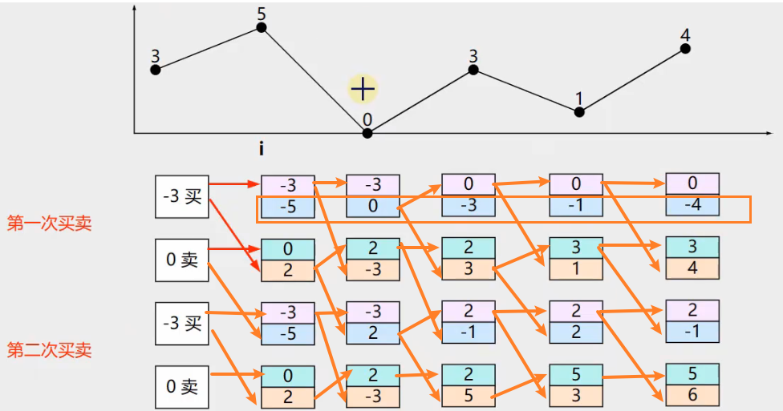
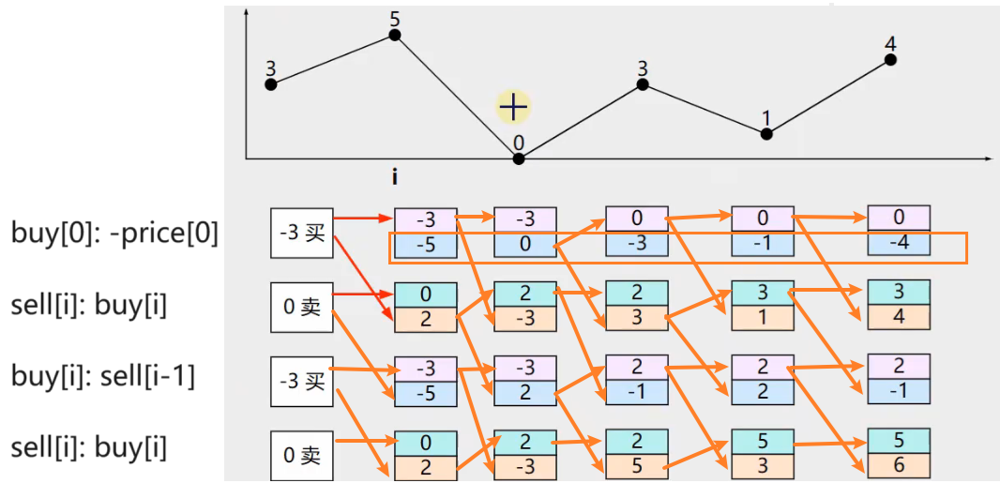
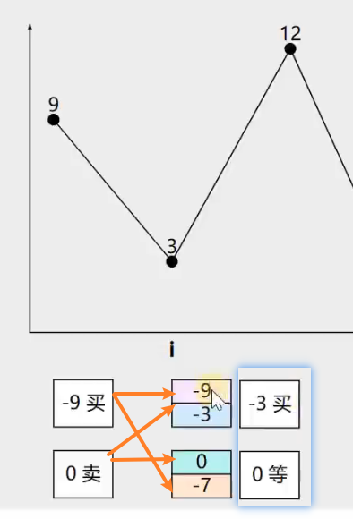
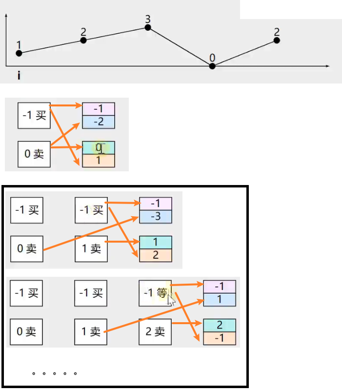

- [一次](#一次)
- [两次](#两次)
- [k次](#k次)
- [多次+手续费](#多次手续费)
- [多次+隔天](#多次隔天)


---

## 一次

误区：最大值-最小值，顺序是会颠倒的！

```java
// 121. 买卖股票的最佳时机
class Solution {
    public int maxProfit(int[] prices) {
        int profit = 0; // 最差一次都不卖
        int i = 0;  // 第1天买入
        // 从第二天开始
        for(int j = 1; j < prices.length; j++){
            profit = Math.max(profit, prices[j] - prices[i]);
            // 选择最低价格的那天买入
            if(prices[j] < prices[i]){
                i = j;
            }
        }
        return profit;
    }
}
```
```java
// 121. 买卖股票的最佳时机
class Solution {
    public int maxProfit(int[] prices) {
        int profit = 0;
        int minPrice = prices[0];
        // 从第二天开始也行，因为第一天 profit, minPrice 维持原值
        for(int price: prices){
            profit = Math.max(profit, price - minPrice);
            minPrice = Math.min(price, minPrice);
        }
        return profit;
    }
}
```

## 两次

```java
// 123. 买卖股票的最佳时机 III
class Solution {
    public int maxProfit(int[] prices) {
        int buy1 = -prices[0];
        int buy2 = -prices[0];
        int sell1 = 0;
        int sell2 = 0;
        for(int i = 0; i < prices.length; i++){
            buy1 = Math.max(buy1, -prices[i]);
            sell1 = Math.max(sell1, buy1 + prices[i]);
            buy2 = Math.max(buy2, sell1 - prices[i]);
            sell2 = Math.max(sell2, buy2 + prices[i]);
        }
        return sell2;
    }
}
```

## k次


```java
// 188. 买卖股票的最佳时机 IV
class Solution {
    public int maxProfit(int k, int[] prices) {
        int[] buy = new int[k];
        Arrays.fill(buy, -prices[0]);
        int[] sell = new int[k];
        Arrays.fill(sell, 0);
        for (int i = 1; i < prices.length; i++) {
            for (int j = 0; j < k; j++) {
                if(j == 0){
                    buy[j] = Math.max(buy[j], -prices[i]);
                }
                else{
                    buy[j] = Math.max(buy[j], sell[j - 1] - prices[i]);
                }
                sell[j] = Math.max(sell[j], buy[j] + prices[i]);
            }
        }
        return sell[k - 1];
    }
}
```
## 多次+手续费

```java
// 714. 买卖股票的最佳时机含手续费
class Solution {
    public int maxProfit(int[] prices, int fee) {
        int buy = -prices[0];
        int sell = 0;
        for (int i = 1; i < prices.length; i++) {
            buy = Math.max(buy, sell - prices[i]);
            sell = Math.max(sell, buy + prices[i] - fee);
        }
        return sell;
    }
}
```

## 多次+隔天

```java
// 309. 买卖股票的最佳时机含冷冻期
class Solution {
    public int maxProfit(int[] prices) {
        int buy = -prices[0];
        int sell = 0;
        int preSell = 0;
        for(int i = 1; i < prices.length; i++){
            buy = Math.max(buy, preSell - prices[i]);
            if(i > 1){
                preSell = sell;
            }
            sell = Math.max(sell, buy + prices[i]);
        }
        return sell;
    }
}
```
