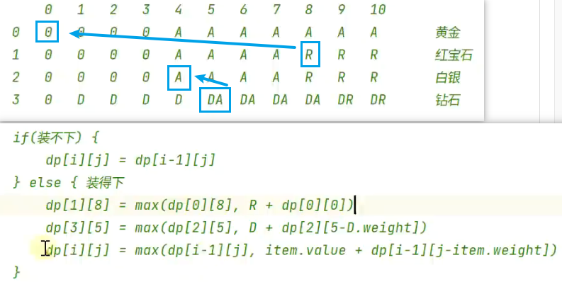
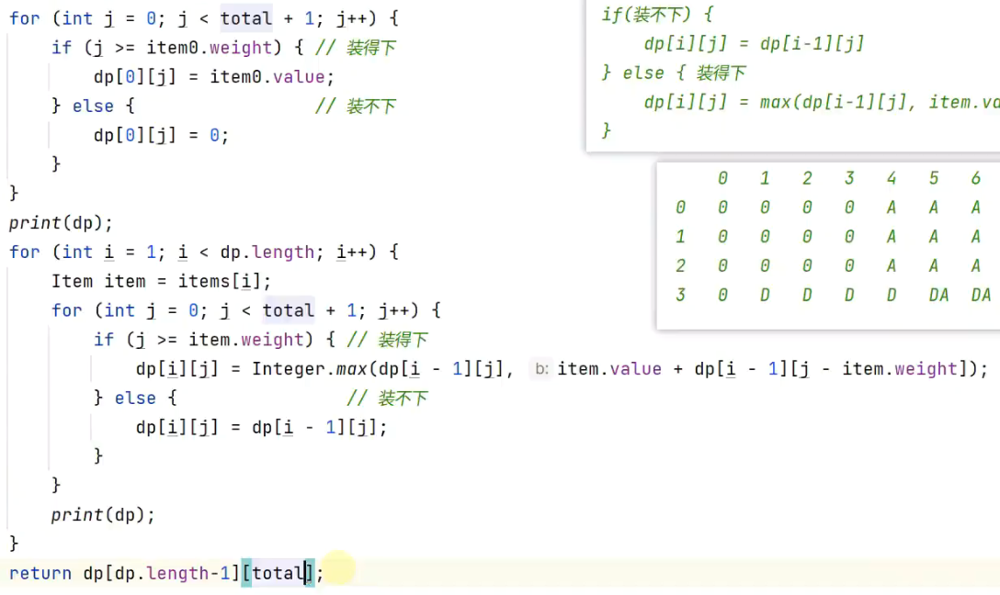
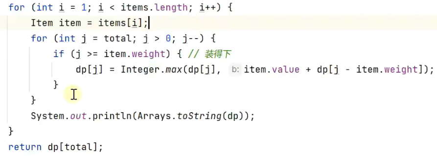
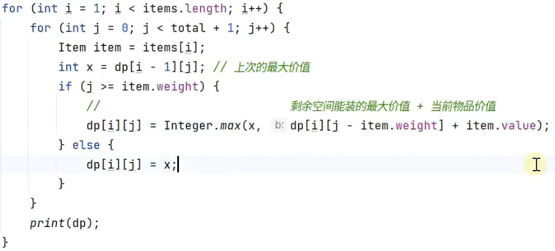
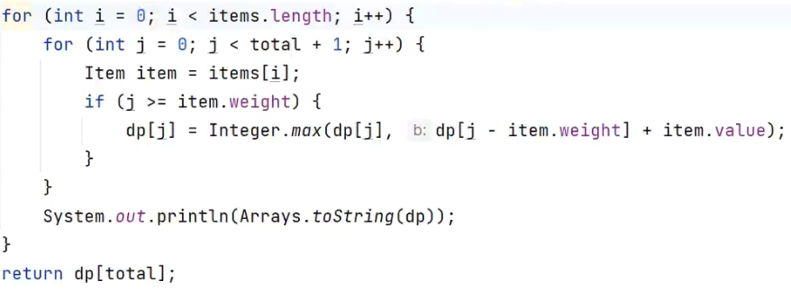

## 背包问题
背包问题：分数背包(贪心）、0-1背包（动态规划）、无限背包（动态规划）。

> 分数背包：贪心策略，选额单价最高。

> 0-1背包：整个物品。上一行

> 完全背包：无限物品。本行

## 分数背包
- 按照单价逆序。
- 遍历装入背包，判断拿完和拿不完。拿完就装入，减小容量；拿不完，就装入部分，把剩余空间填满。

## 01背包

不需要物品价值排序。

倒着。因为需要上一行j前面的结果不变，所以正序不行，得倒序。

## 完全背包

因为都是同一行，所以不需要初始化第一行。

## 总结

- 二维简化为一维：如果依赖旧的，就倒序。
- 初始化而跳过预备元素：[初始化而跳过预备元素](<leetcode/198. 打家劫舍.md>)