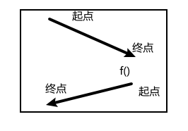

- [前后位置](#前后位置)
- [类的成员变量什么都可以干](#类的成员变量什么都可以干)
  - [代替函数参数中传递不变的参数](#代替函数参数中传递不变的参数)
  - [代替函数参数中传递需要变化的参数](#代替函数参数中传递需要变化的参数)
  - [返回值](#返回值)
- [循环变递归](#循环变递归)
- [记忆数组](#记忆数组)
- [多路递归](#多路递归)
- [多路递归→回溯](#多路递归回溯)

---

## 前后位置
```java
void f(Node node) {
    // 临界条件
    if(node == null) {
        return;
    }

    // 递归前的操作：顺序
    println("before:" + node.value)
    
    f(node.next);

    // 递归前的操作：倒序
    println("after:" + node.value)
}
```

```java
// 1 -> 2 -> 3 -> null  f(1)

void f(Node node = 1) {
    println("before:" + node.value) // 1
    void f(Node node = 2) {
        println("before:" + node.value) // 2
        void f(Node node = 3) {
            println("before:" + node.value) // 3
            void f(Node node = null) {
                if(node == null) {
                    return;
                }
            }
            println("after:" + node.value) // 3
        }
        println("after:" + node.value) // 2
    }
    println("after:" + node.value) // 1
}

// 3 -> 2 -> 1 -> null  f(3)

void f(Node node = 3) {
    println("before:" + node.value) // 3
    void f(Node node = 2) {
        println("before:" + node.value) // 2
        void f(Node node = 1) {
            println("before:" + node.value) // 1
            void f(Node node = null) {
                if(node == null) {
                    return;
                }
            }
            println("after:" + node.value) // 1
        }
        println("after:" + node.value) // 2
    }
    println("after:" + node.value) // 3
}
```

e.g. [递归反向打印字符串](leetcode递归.md)

## 类的成员变量什么都可以干

类的成员变量：
- 代替函数参数中传递不变的参数
- 代替函数参数中传递需要变化的参数
- 代替返回值

### 代替函数参数中传递不变的参数
```java
// 普通方式传递
public class Main{
    public static void main(){
        str = new String("abc");
        f(0, str);
    }

    // str
    public static void f(int n, String str) {
        if (n == str.length()) {
            return;
        }
        f(n + 1, str);
        System.out.println(str.charAt(n));
    }
}

// 类的成员变量
public class Main{
    String str;

    public static void main(){
        str = new String("abc");
        f(0);
    }

    public static void f(int n) {
        if (n == str.length()) {
            return;
        }
        f(n + 1);
        System.out.println(str.charAt(n));
    }
}
```

### 代替函数参数中传递需要变化的参数

用回溯来做。
```java
    public void dfs(int n, int i, int j, int target) {
        if (n == 2) {
            twoSum(i, j, target);
            return;
        }

        for (int k = i; k < j; k++) {
            if (k > i && nums[k] == nums[k - 1]) {
                continue;
            }
            stack.push(nums[k]);
            dfs(n - 1, k + 1, j, target - nums[k]);
            stack.pop();
        }
    }

    public void dfs(int n, int i, int j) {
        if (n == 2) {
            twoSum(i, j, target);
            return;
        }

        for (int k = i; k < j; k++) {
            if (k > i && nums[k] == nums[k - 1]) {
                continue;
            }
            stack.push(nums[k]);
            target = target - nums[k];      // 修改
            dfs(n - 1, k + 1, j);
            target = target + nums[k];      // 回溯恢复
            stack.pop();
        }
    }
```
### 返回值

返回值天生就是倒着的：位于递归后面————尾递归`return f()` 即`int a = f(); return a`

本轮的返回值，和本轮中调用下一轮递归的返回值有关。所以设计边界条件，要考虑其返回值的意义。

反转链表的递归: 返回最后一个节点的位置，层层向上传递最后一个

```java
class Solution {
    public ListNode reverseList(ListNode head) {
        // 两个都是不适合递归的特例
        if(head == null || head.next == null){
            return head;
        }
        return f(head);
    }

    public ListNode f(ListNode head){
        // 返回最后一个节点的位置
        if(head.next == null){
            return head;
        }
        ListNode last = f(head.next);
        head.next.next = head;
        head.next = null;
        return last;     // 层层向上传递最后一个
    }
}
```
```java
class Solution {
    // 类的成员变量
    ListNode last;
    public ListNode reverseList(ListNode head) {
        if(head == null || head.next == null){
            return head;
        }
        f(head);
        return last;
    }

    public void f(ListNode head){
        if(head.next == null){
            last = head;
            return;
        }
        f(head.next);
        head.next.next = head;
        head.next = null;
    }
}
```
## 循环变递归

把最外层的循环拆出来。

`for(int i = 0 ; i < 10; i++)`
- `if(i>=10)`就是临界条件
- `recursion(..., 0)`->`recursion(..., i + 1)`

`while(i<=j), int i = 0, int j = 10, i++, j--`
- `if(i>j)`临界条件
- `recursion(..., i, j)` -> `recursion(..., i + 1, j - 1)`


## 记忆数组

两种方式：一种在递归外面填充边界条件，另一种在递归内作为边界条件填充数组。

记忆数组的递归不用特别调用，正常就行。

这玩意也可以用动态规划来做。

## 多路递归

for循环展开看

## 多路递归→回溯

标准模板：void dfs
- 用栈保存符合的链路结果。
- 保存结果处、剪枝处、正向操作-递归-反向操作处。
```java
class Solution {
    // 保存每条从根到叶子的链路
    LinkedList<Integer> stack = new LinkedList<>();
    // 所有的链路
    List<List<Integer>> result = new ArrayList<>();
    // 剪枝：已遍历的节点
    boolean[] vis;
    int[] nums;


    public List<List<Integer>> permute(int[] nums) {
        vis = new boolean[nums.length];
        this.nums = nums;
        dfs();
        return result;
    }

    public void dfs() {
        // 保存结果处
        if (stack.size() == nums.length) {
            result.add(new ArrayList<>(stack));
            return;
        }

        for (int i = 0; i < nums.length; i++) {
            // 剪枝处
            if(vis[i]){
                continue;
            }
            // 正向操作：放入、标记已遍历
            stack.push(nums[i]);
            vis[i] = true;
            dfs();
            // 反向操作：拿出、取消标记
            vis[i] = false;
            stack.pop();
        }
    }
}
```

找到即终止：dfs返回boolean
- 保存结果处：有符合的结果直接return true
- 递归处：会先判断是否直接结束
```java
// 37. 解数独
class Solution {
    // 表示已经被占用
    boolean[][] rows = new boolean[9][9];
    boolean[][] columns = new boolean[9][9];
    boolean[][] cells = new boolean[9][9];
    char[][] board;

    public void solveSudoku(char[][] board) {
        for (int i = 0; i < 9; i++) {
            for (int j = 0; j < 9; j++) {
                char c = board[i][j];
                if (c != '.') {
                    rows[i][c - '1'] = columns[j][c - '1'] = cells[i / 3 * 3 + j / 3][c - '1'] = true;
                }
            }
        }
        this.board = board;
        System.out.println(dfs(0, 0));
        for (int i = 0; i < 9; i++) {
            for (int j = 0; j < 9; j++) {
                char c = board[i][j];
                System.out.print(c);
            }
            System.out.println();
        }
    }

    public boolean dfs(int i, int j) {
        // 保存结果处：有符合的结果直接return true
        while (board[i][j] != '.') {
            if (++j >= 9) {
                j = 0;
                if (++i >= 9) {
                    return true;
                }
            }
        }
        for (int k = 1; k <= 9; k++) {
            // 剪枝处
            if (rows[i][k - 1] || columns[j][k - 1] || cells[i / 3 * 3 + j / 3][k - 1]) {
                continue;
            }


            rows[i][k - 1] = columns[j][k - 1] = cells[i / 3 * 3 + j / 3][k - 1] = true;
            board[i][j] = (char) (k + '0');
            // 递归会先判断是否直接结束
            if(dfs(i, j)){
                return true;
            }      
            board[i][j] = '.';
            rows[i][k - 1] = columns[j][k - 1] = cells[i / 3 * 3 + j / 3][k - 1] = false;
        }
        return false; 
    }
}
```