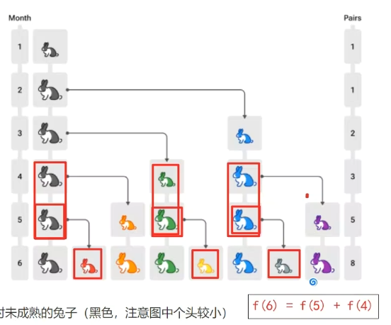

- [1. 前后位置](#1-前后位置)
- [2. 传递不变的参数](#2-传递不变的参数)
- [3. 返回值](#3-返回值)
- [4. 循环变递归](#4-循环变递归)
- [5. 记忆数组](#5-记忆数组)
- [6. 题](#6-题)
  - [6.1. 斐波那契数列](#61-斐波那契数列)
    - [6.1.1. 兔子](#611-兔子)
    - [6.1.2. 爬楼梯](#612-爬楼梯)
  - [6.2. 汉诺塔](#62-汉诺塔)
  - [6.3. 杨辉三角](#63-杨辉三角)

---
## 1. 前后位置
```java
void f(Node node) {
    // 临界条件
    if(node == null) {
        return;
    }

    // 递归前的操作：顺序
    println("before:" + node.value)
    
    f(node.next);

    // 递归前的操作：倒序
    println("after:" + node.value)
}
```

```java
// 1 -> 2 -> 3 -> null  f(1)

void f(Node node = 1) {
    println("before:" + node.value) // 1
    void f(Node node = 2) {
        println("before:" + node.value) // 2
        void f(Node node = 3) {
            println("before:" + node.value) // 3
            void f(Node node = null) {
                if(node == null) {
                    return;
                }
            }
            println("after:" + node.value) // 3
        }
        println("after:" + node.value) // 2
    }
    println("after:" + node.value) // 1
}

// 3 -> 2 -> 1 -> null  f(3)

void f(Node node = 3) {
    println("before:" + node.value) // 3
    void f(Node node = 2) {
        println("before:" + node.value) // 2
        void f(Node node = 1) {
            println("before:" + node.value) // 1
            void f(Node node = null) {
                if(node == null) {
                    return;
                }
            }
            println("after:" + node.value) // 1
        }
        println("after:" + node.value) // 2
    }
    println("after:" + node.value) // 3
}
```

例子：[反向字符串两种方式都写了](./E02ReversePrintString.java)

## 2. 传递不变的参数
```java
public static void f(int n, String str) {
    if (n == str.length()) {
        return;
    }
    f(n + 1, str);
    System.out.println(str.charAt(n));
}
```
```java
int f(int[] a, int target, ...) {
    if(i > j){
        return -1;
    }

    return f(a, target, ...);
}
```

## 3. 返回值

```java
int f(...) {
    if(i > j){
        return -1;
    }

    if (...){
        // 忘记 return 了
        return f(...);
    }else if (...){
        return f(...);
    }else{
        return a[m];
    }
}
```

反转链表的递归: 最后一层newHead最后一个节点，head是倒数第二，但是return 为什么返回newHead

```java
class Solution {
    public ListNode reverseList(ListNode head) {
        if (head == null || head.next == null) {
            return head;
        }
        ListNode newHead = reverseList(head.next);
        head.next.next = head;
        head.next = null;
        return newHead;
    }
}
```
## 4. 循环变递归

把最外层的循环拆出来。

`for(int i = 0 ; i < 10; i++)`
- `if(i>=10)`就是临界条件
- `recursion(..., 0)`->`recursion(..., i + 1)`

`while(i<=j), int i = 0, int j = 10, i++, j--`
- `if(i>j)`临界条件
- `recursion(..., i, j)` -> `recursion(..., i + 1, j - 1)`


## 5. 记忆数组
两种方式：一种在递归外面填充边界条件，另一种在递归内作为边界条件填充数组。

记忆数组的递归不用特别调用，正常就行。
```java
/**
    * <h3>使用 Memoization(记忆法, 也称备忘录) 改进</h3>
    */
public static int fibonacciRecursion1(int n) {
    // 预先定义一个数组
    int[] cache = new int[n + 1];
    // 填充-1是为了记忆数组作为已填充的退出条件
    Arrays.fill(cache, -1); // [-1,-1,-1,-1,-1,-1]
    // 边界条件写到数组里，初始化前两个数
    cache[0] = 0;
    cache[1] = 1;
    return f(n, cache);
}

/*
    * 用递归填满记忆数组: 初始化前两个数
    */
private static int f(int n, int[] cache) {
    if (cache[n] != -1) {
        return cache[n];
    }

    int x = f(n - 1, cache);
    int y = f(n - 2, cache);
    cache[n] = x + y;
    return cache[n];
}
```
```java
/**
    * <h3>使用 Memoization(记忆法, 也称备忘录) 改进</h3>
    */
public static int fibonacciRecursion2(int n) {
    int[] cache = new int[n + 1];
    Arrays.fill(cache, -1); // [-1,-1,-1,-1,-1,-1]
    return f2(n, cache);
}

/*
    * 用递归填满记忆数组: 在边界条件内写初始化条件
    */
private static int f2(int n, int[] cache) {
    if (cache[n] != -1) {
        return cache[n];
    }

    // 在边界条件内写初始化条件
    if (n == 0) {
        cache[0] = 0;
        return cache[0];
    } else if (n == 1) {
        cache[1] = 1;
        return cache[1];
    }

    int x = f2(n - 1, cache);
    int y = f2(n - 2, cache);
    cache[n] = x + y;
    return cache[n];
}
```
## 6. 题

### 6.1. 斐波那契数列

$$
f(n) = 
\begin{cases}
0 & n=0 \\
1 & n=1 \\
f(n-1) + f(n-2) & n>1
\end{cases}
$$

下面的表格列出了数列的前几项

| *f*0 | *f*1 | *f*2 | *f*3 | *f*4 | *f*5 | *f*6 | *f*7 | *f*8 | *f*9 | *f*10 | *f*11 | *f*12 | *f*13 |
| ---- | ---- | ---- | ---- | ---- | ---- | ---- | ---- | ---- | ---- | ----- | ----- | ----- | ----- |
| 0    | 1    | 1    | 2    | 3    | 5    | 8    | 13   | 21   | 34   | 55    | 89    | 144   | 233   |

> 递归的次数`2 * f(n+1) - 1`。

> **时间复杂度**

* 递归的次数也符合斐波那契规律，$2 * f(n+1)-1$
* 时间复杂度推导过程
  * 斐波那契通项公式 $f(n) = \frac{1}{\sqrt{5}}*({\frac{1+\sqrt{5}}{2}}^n - {\frac{1-\sqrt{5}}{2}}^n)$
  * 简化为：$f(n) = \frac{1}{2.236}*({1.618}^n - {(-0.618)}^n)$
  * 带入递归次数公式 $2*\frac{1}{2.236}*({1.618}^{n+1} - {(-0.618)}^{n+1})-1$
  * 时间复杂度为 $\Theta(1.618^n)$

#### 6.1.1. 兔子



上个月的兔子 + 上个月成熟的兔子生的兔子 = 上个月的兔子 + 上个月成熟的兔子 = 上个月的兔子 + 上上个月的兔子。

#### 6.1.2. 爬楼梯


按跳1个和跳2个到第4台阶算→2阶、3阶。

因此本质上还是斐波那契数列，只是从其第二项开始f(2)


### 6.2. 汉诺塔


以最后一个盘子为分界：
- 把 n-1 个盘子，由a,借c,移至b
- 把最后的盘子， 由a,借b,移至 c
- 把 n-1 个盘子，由b,借a,移至c

### 6.3. 杨辉三角

斜着看，行 $i$，列 $j$
```
1
1   1
1   2   1
1   3   3   1
1   4   6   4   1
```

* 递归：
    
    当前元素 = 上一行左上角元素 + 上一行上面元素

    $[i][j] = [i-1][j-1] + [i-1][j]$
* 边界条件：
    
    当面没有元素 $a[i-1][j]$ 不存在————对应斜边  $i=j$ 
    
    或者左上角没有元素 $a[i-1][j-1]$————对应最左一列 $j=0$ 

    当 $j=0$ 或 $i=j$ 时，$[i][j]$ 取值为 $1$