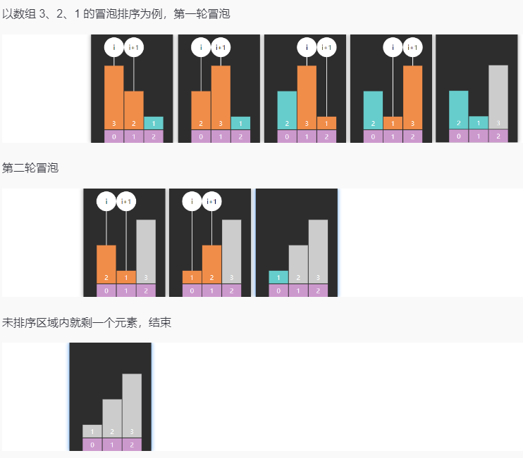
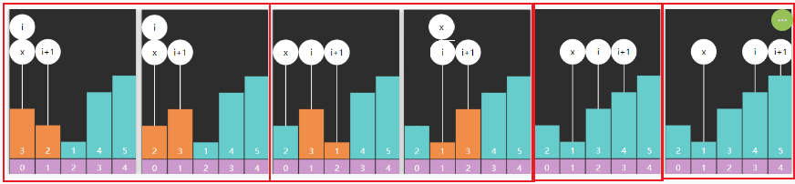
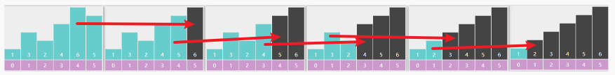

- [1. 冒泡排序](#1-冒泡排序)
  - [1.1. 基础版 bubbleSortBasic](#11-基础版-bubblesortbasic)
  - [1.2. 改进版 bubbleSortX](#12-改进版-bubblesortx)
- [2. 选择排序](#2-选择排序)
- [3. 堆排序](#3-堆排序)
- [4. 插入排序](#4-插入排序)
- [5. 希尔排序](#5-希尔排序)
- [6. 归并排序](#6-归并排序)
  - [6.1. 递归：自顶向下](#61-递归自顶向下)
  - [6.2. 非递归实现：自底向上](#62-非递归实现自底向上)
  - [6.3. 递归实现+元素少时插入排序](#63-递归实现元素少时插入排序)
- [7. 快速排序](#7-快速排序)


---

```java
public void swap(int[] nums, int i, int j) {
    if(i == j) return;
    nums[i] = nums[i] ^ nums[j];
    nums[j] = nums[i] ^ nums[j];
    nums[i] = nums[i] ^ nums[j];
}
```


| 算法 |    最好    |    最坏    |    平均    |  空间   | 稳定 | 思想 |                           注意事项                           | 速度| 优化|
| :--: | :--------: | :--------: | :--------: | :-----: | :--: | :--: | :----------------------------------------------------------: | :-:| :-:|
| 冒泡 |    O(n)    |  O($n^2$)  |  O($n^2$)  |  O(1)   |  Y   | 比较 |  最好情况需要优化版本，而且是已经有序的数组 |超时| x记录最后一次交换位置|
| 选择 |  O($n^2$)  |  O($n^2$)  |  O($n^2$)  |  O(1)   |  N   | 比较 |交换次数一般少于冒泡                     | 超时|
|  堆  | O($nlogn$) | O($nlogn$) | O($nlogn$) |  O(1)   |  N   | 选择 |                                 | 快|非递归下潜|
| 插入 |    O(n)    |  O($n^2$)  |  O($n^2$)  |  O(1)   |  Y   | 比较 |最好情况是已经有序的数组                   | 巨慢|优化就是希尔排序|
| 希尔 |  O(nlogn)  |  O($n^2$)  | O($nlogn$) |  O(1)   |  N   | 插入 |                                 | 比堆排序还快| |
| 归并 | O($nlogn$) | O($nlogn$) | O($nlogn$) |  O(n)   |  Y   | 分治 |需要额外的O(n)的存储空间 |比希尔排序还快||
| 快速 | O($nlogn$) |  O($n^2$)  | O($nlogn$) | O(logn) |  N   | 分治 | 需要把枢轴值随机化来缓解最坏情况 |巨慢|

## 1. 冒泡排序

[bubbleSortBasic](./BubbleSort.java)

### 1.1. 基础版 bubbleSortBasic

* 每轮冒泡不断地比较**相邻**的两个元素，如果它们是逆序的，则交换它们的位置
* 下一轮冒泡，可以调整未排序的右边界，减少不必要比较


```java
public int[] sortArray(int[] nums) {
    for (int i = nums.length - 1; i >= 1; i--) {
        for (int j = 0; j < i; j++) {
            // 逆序
            if (nums[j] > nums[j + 1]) {
                swap(nums, j, j + 1);
            }
        }
    }
    return nums;
}

j是实际元素的索引`a[j+1]`，i是j的边界。
           [ i 的范围   ]    // 因为 j < i
       [  j的范围   ]        // 因为 a[j+1]
index: 0   1   2   3   4
```
```java
public int[] sortArray(int[] nums) {
    sort(nums, nums.length - 1);
    return nums;
}

public void sort(int[] nums, int i) {
    if (i < 1) {
        return;
    }
    for (int j = 0; j < i; j++) {
        if (nums[j] > nums[j + 1]) {
            swap(nums, j, j + 1);
        }
    }
    sort(nums, i - 1);
}
```
### 1.2. 改进版 bubbleSortX

- 用`x`记录最后一次交换的位置 `j`，最后一次交换 j 处是待排序数组的end索引（右边是有序的，j及其左是待排）。
- 让下一轮的 `i = x`。


```java
public int[] sortArray(int[] nums) {
    // 让下一轮的 `i = x`
    for(int i = nums.length - 1; i >= 1;){
        int x = 0;
        for(int j = 0 ; j < i; j++){
            if(nums[j] > nums[j+1]){
                swap(nums, j , j+1);
                x = j;
            }
        }
        i = x;
    }
    return nums;
}
```
```java
public int[] sortArray(int[] nums) {
    sort(nums, nums.length - 1);
    return nums;
}

public void sort(int[] nums, int i) {
    if (i < 1) {
        return;
    }
    int x = 0;
    for (int j = 0; j < i; j++) {
        if (nums[j] > nums[j + 1]) {
            swap(nums, j, j + 1);
            x = j;
        }
    }
    sort(nums, x);
}
```
## 2. 选择排序

每一轮选择，找出最大（最小）的元素，并把它交换到合适的位置

- 默认最大值从数组最后一个元素开始。（优化：最后一轮只剩一个元素可以不比较，它之前没有元素了）
- 比较它和它前面的元素。
- 将最大的元素放在它的位置上。（优化：如果是本身，那么不用交换）





```java
public int[] sortArray(int[] nums) {
    // 默认最大元素的索引是i
    for(int i = nums.length - 1; i >= 1; i--){
        int max = i;
        // 它之前的元素
        for(int j = 0 ; j < i; j++){
            if(nums[j] > nums[max]){
                max = j;
            }
        }
        if(max != i){
            swap(nums, i, max);
        }
    }
    return nums;
}
```
## 3. 堆排序

1. 建大顶堆
2. 出堆顶直到剩一个。
```java
public int[] sortArray(int[] nums) {
    // 1. 建大顶堆
    int size = nums.length;
    buildHeap(nums, size);

    // 2. 出堆顶直到剩一个。
    for (int i = size - 1; i >= 1; i--) {
        // 交换堆顶和最后一个元素
        swap(nums, 0, i);
        // 重新下潜堆顶，i=size-1，刚好是新堆的大小
        down(nums, 0, i);
    }
    return nums;
}

public void buildHeap(int[] nums, int size) {
    // 从最后一个非叶子结点往堆顶，下潜
    for (int i = size / 2 - 1; i >= 0; i--) {
        down(nums, i, size);
    }
}

// 递归
// public void down(int[] nums, int parent, int size) {
//     int left = parent * 2 + 1;
//     int right = left + 1;
//     int max = parent;
//     // nums[left] > nums[max]: 是和max比
//     if (left < size && nums[left] > nums[max]) {
//         max = left;
//     }
//     if (right < size && nums[right] > nums[max]) {
//         max = right;
//     }
//     // 找到了更大的孩子
//     if (max != parent) {
//         swap(nums, max, parent);
//         down(nums, max, size);
//     }
// }

// 循环
public void down(int[] nums, int parent, int size) {
    while (true) {
        int left = parent * 2 + 1;
        int right = left + 1;
        int max = parent;
        if (left < size && nums[left] > nums[max]) {
            max = left;
        }
        if (right < size && nums[right] > nums[max]) {
            max = right;
        }
        if (max != parent) {
            swap(nums, max, parent);
            parent = max;
        } else {
            break;
        }
    }
}
```

## 4. 插入排序

- 将数组分为已排序部分和未排序部分：`[0 .. low-1]`  `[low .. a.length-1]`(优化：第一个不用排：low=1开始)
- 每次从未排序区域取出low下标的元素, 插入到已排序区域
- 插入到已排序区域：从low倒着往前，检查 low 左边的元素 `int i = low - 1;`，如果左边大于low所在的元素 `a[i] > a[low]`，就右移数组 `a[i+1] = a[i]`

```java
public int[] sortArray(int[] nums) {
    for (int low = 1; low < nums.length; low++) {
        // 因为会覆盖 low下标的元素，所以要保存到临时变量
        int t = nums[low];
        int i = low - 1;
        // nums[i] > t 就是不稳定了
        while (i >= 0 && nums[i] > t) { 
            nums[i + 1] = nums[i];
            i--;
        }
        // 刚好左边直接不满足，那么就是原位置不插 i+1= low-1+1=low
        if (i != low - 1) {
            nums[i + 1] = t;    // 当前是不符合的位置 nums[i] <= t，所以插入到下一个位置
        }
    }
    return nums;
}
```
```java
/*
    *  比上面赋值次数更多
    */
public static void insertSortSwap(int[] a){
    for (int low = 1; low < a.length; low++) {
        int i = low - 1;    // 遍历检查 low 左边的
        // 如果左边大于的就右移数组, a[low]就是初始的a[i+1]
        while (i >= 0 && a[i] > a[i+1]) {
            // 直接交换
            int t = a[i];
            a[i] = a[i+1];
            a[i+1] = t;
            i--;
        }
    }
}

public static void insertSortRecursion(int[] a) {
    recursion(a, 1);
}

public static void recursion(int[] a, int low) {
    if (low >= a.length) {
        return;
    }
    int l = a[low];
    int i = low - 1;
    while (i >= 0 && a[i] > l) {
        a[i + 1] = a[i];
        i--;
    }
    if (i != low - 1) {
        a[i + 1] = l;
    }
    recursion(a, low + 1);
}
```

## 5. 希尔排序

插入排序改进：插入排序如果第一个元素是9，那么它要被移动n次；而希尔排序从大gap往小gap走，移动9的步幅很大，$\log_2 n$就足以。


* 根据步幅gap实现分组的插入排序
* 每轮排序后 gap 逐渐变小，直至 gap 为 1 完成排序 


```java
public int[] sortArray(int[] nums) {
    // gap 不断除2，直到1
    for (int gap = nums.length / 2; gap > 0; gap /= 2) {
        // 1替换为gap
        for (int low = gap; low < nums.length; low++) {
            int t = nums[low];
            int i = low - gap;
            while (i >= 0 && nums[i] > t) {
                nums[i + gap] = nums[i];
                i -= gap;
            }
            if (i != low - gap) {
                nums[i + gap] = t;
            }
        }
    }
    return nums;
}
```

## 6. 归并排序

### 6.1. 递归：自顶向下

```
[5,1,1,2,0,0]
[5,1,1] [2,0,0]     // 而自底向上是 [5,1] [1,2] [0,0]
[5,1] [1] [2,0] [0]
[5] [1] [1] [2] [0] [0]
```
```java
public int[] sortArray(int[] nums) {
    int[] t_arr = new int[nums.length];
    split(nums, 0, nums.length - 1, t_arr);
    return nums;
}

public void split(int[] nums, int left, int right, int[] t_arr) {
    if (left == right) {
        return;
    }
    // 分
    int m = (left + right) >>> 1;
    split(nums, left, m, t_arr);
    split(nums, m + 1, right, t_arr);
    // 并：结果存到临时数组里
    merge(nums, left, m, m + 1, right, t_arr);
    // 将临时数组里的结果拷回原数组
    System.arraycopy(t_arr, left, nums, left, right - left + 1);
}

public void merge(int[] nums, int iLeft, int iRight, int jLeft, int jRight, int[] t_arr) {
    int k = iLeft;  // 0在递归中可以，但为了和非递归保持一致。
    while (iLeft <= iRight && jLeft <= jRight) {
        if (nums[iLeft] < nums[jLeft]) {
            t_arr[k] = nums[iLeft];
            iLeft++;
        } else {
            t_arr[k] = nums[jLeft];
            jLeft++;
        }
        k++;
    }
    if (iLeft <= iRight) {
        System.arraycopy(nums, iLeft, t_arr, k, iRight - iLeft + 1);
    } else {
        System.arraycopy(nums, jLeft, t_arr, k, jRight - jLeft + 1);
    }
}
```

### 6.2. 非递归实现：自底向上

```
[5,1,1,2,0,0]
[5,1] [1,2] [0,0]   
[5,1,1,2] [0,0]     // 而自顶向下是 [5,1,1] [2,0,0]
[5,1,1,2,0,0]   
```
```java
public int[] sortArray(int[] nums) {
    int[] t_arr = new int[nums.length];
    split(nums, t_arr);
    return nums;
}

public void split(int[] nums, int[] t_arr) {
    int length = nums.length;
    // 宽度2，不断膨胀，直到一半能完全盖住数组前（要让左右还有的比较，不能让左边取完数组）
    for (int width = 2; width / 2 < length; width *= 2) {
        for (int left = 0; left < length; left += width) {
            int right = left + width - 1;
            int m = Math.min((left + right) >>> 1, length - 1);
            right = Math.min(right, length - 1);
            merge(nums, left, m, m + 1, right, t_arr);
        }
        System.arraycopy(t_arr, 0, nums, 0, length);
    }
}

public void merge(int[] nums, int iLeft, int iRight, int jLeft, int jRight, int[] t_arr) {
    int k = iLeft;
    while (iLeft <= iRight && jLeft <= jRight) {
        if (nums[iLeft] < nums[jLeft]) {
            t_arr[k] = nums[iLeft];
            iLeft++;
        } else {
            t_arr[k] = nums[jLeft];
            jLeft++;
        }
        k++;
    }
    if (iLeft <= iRight) {
        System.arraycopy(nums, iLeft, t_arr, k, iRight - iLeft + 1);
    } else {
        System.arraycopy(nums, jLeft, t_arr, k, jRight - jLeft + 1);
    }
}
```

### 6.3. 递归实现+元素少时插入排序

元素少时插入排序，是在分裂中，而不是一开始判断数组用归并还是分裂。

```java
class Solution {
    public int[] sortArray(int[] nums) {
        int[] t_arr = new int[nums.length];
        split(nums, 0, nums.length - 1, t_arr);
        return nums;
    }

    public void insertion(int[] nums, int left, int right){
        for(int low = left + 1; low <= right; low++){
            int t = nums[low];
            int i = low - 1;
            while(i >= left && nums[i] > t){
                nums[i + 1] = nums[i];
                i--;
            }
            if(i != low -1){
                nums[i + 1] = t;
            }
        }
    }

    public void split(int[] nums, int left, int right, int[] t_arr) {
        if (left == right) {
            return;
        }
        else if (right - left <= 32) {
            insertion(nums, left, right);
            return;
        }
        // 分
        int m = (left + right) >>> 1;
        split(nums, left, m, t_arr);
        split(nums, m + 1, right, t_arr);
        // 并：结果存到临时数组里
        merge(nums, left, m, m + 1, right, t_arr);
        // 将临时数组里的结果拷回原数组
        System.arraycopy(t_arr, left, nums, left, right - left + 1);
    }

    public void merge(int[] nums, int iLeft, int iRight, int jLeft, int jRight, int[] t_arr) {
        int k = iLeft;
        while (iLeft <= iRight && jLeft <= jRight) {
            if (nums[iLeft] < nums[jLeft]) {
                t_arr[k] = nums[iLeft];
                iLeft++;
            } else {
                t_arr[k] = nums[jLeft];
                jLeft++;
            }
            k++;
        }
        if (iLeft <= iRight) {
            System.arraycopy(nums, iLeft, t_arr, k, iRight - iLeft + 1);
        } else {
            System.arraycopy(nums, jLeft, t_arr, k, jRight - jLeft + 1);
        }
    }

    public void swap(int[] nums, int i, int j) {
        nums[i] = nums[i] ^ nums[j];
        nums[j] = nums[i] ^ nums[j];
        nums[i] = nums[i] ^ nums[j];
    }
}
```

## 7. 快速排序

1. 单边循环 Lomuto：巨慢
2. 双边 j 先：巨慢
3. 双边 i 先：慢

```java
public int[] sortArray(int[] nums) {
    quick(nums, 0, nums.length - 1);
    return nums;
}

public void quick(int[] nums, int left, int right) {
    if (left >= right) {
        return;
    }
    int p = partition(nums, left, right);
    quick(nums, left, p - 1);
    quick(nums, p + 1, right);
}
```
* 选择最左侧元素作为基准点
* j 找比基准点小于等于的，i 找比基准点大于的（大于等于的），一旦找到，二者进行交换
  * i 从左向右
  * j 从右向左
* 最后基准点与 i 交换，j 即为基准点最终索引
```java
// 双边 j 先
public int partition(int[] nums, int left, int right) {
    int pv = nums[left];
    int i = left;
    int j = right;
    while (i < j) {
        // j找小于等于的
        while (i < j && nums[j] > pv) {
            j--;
        }
        // i找大于的：不等于是因为下一swap后ij不自增自减，i等于的交换给j，j等于就不进入while了。
        while (i < j && nums[i] <= pv) {
            i++;
        }
        swap(nums, i, j);
    }
    swap(nums, j, left);
    return j;
}
```
```java
// 双边 i 先
public int partition(int[] nums, int left, int right) {
    int pv = nums[left];
    int i = left + 1;
    int j = right;
    while (i <= j) {
        while (i <= j && nums[i] < pv) {
            i++;
        }
        while (i <= j && nums[j] > pv) {
            j--;
        }
        if (i <= j) {
            swap(nums, i, j);
            i++;
            j--;
        }
    }
    swap(nums, j, left);
    return j;
}
```