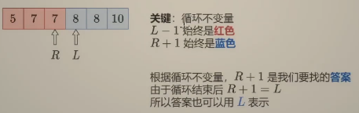

- [1. 重要](#1-重要)
  - [1.1. 基础版：ij都查](#11-基础版ij都查)
  - [1.2. Leftmost 与 Rightmost的-1版本](#12-leftmost-与-rightmost的-1版本)
  - [1.3. Leftmost 与 Rightmost 的i/i-1版](#13-leftmost-与-rightmost-的ii-1版)
  - [1.4. 递归版](#14-递归版)
- [leetcode](#leetcode)
    - [35. 搜索插入位置](#35-搜索插入位置)
    - [278. 第一个错误的版本](#278-第一个错误的版本)
    - [34. 在排序数组中查找元素的第一个和最后一个位置](#34-在排序数组中查找元素的第一个和最后一个位置)
    - [leftmost i](#leftmost-i)

---
## 1. 重要

首先，要求数组有序。

**target < a[m] < target，target在两边**。

1. 基础版和改动版：区别就是**左闭右闭**、左闭右开。

     - **j = n -1** , j = n
     - **while(i<=j)**, while(i<j)
     - **j = m- 1**, j = m

2. 基础版的复杂度

    时间复杂度
    * 最坏情况：$O(\log n)$
    * 最好情况：如果待查找元素恰好在数组中央，只需要循环一次 $O(1)$
    
    空间复杂度
    * 需要常数个指针 $i,j,m$，因此额外占用的空间是 $O(1)$ 

3. leftmost和rightmost的标准版：找不到返回-1

    - leftmost: 找到了往左移， j = m - 1
    - rightmost: 找到了往右移， i = m + 1
4. leftmost和rightmost的替身版：找不到返回替身

    - leftmost：大于等于的最左 `target <= a[m]`, i
    - rightmost：小于等于的最右 `a[m] <= target`，i-1

### 1.1. 基础版：ij都查 

元素在最左边 L 次， 元素在最右边 2L 次
```java
// 704. 二分查找
class Solution {
    public int search(int[] nums, int target) {
        int i = 0, j = nums.length - 1;
        while (i <= j) {                // [i,j] 范围内有东西
            int m = (i + j) >>> 1;      /// (i+j)/2的向下取整
            if (target < nums[m]) {             // 目标在左边
                j = m - 1;
            } else if (nums[m] < target){       // 目标在右边
                i = m + 1;
            } else{                             // 找到了
                return m;
            }
        }
        return -1;
        // 返回将会被按顺序插入的位置。
        //      return i;         直接写法
        //      return -(i + 1);  java底层写法
    }
}
```

### 1.2. Leftmost 与 Rightmost的-1版本

返回的是最左侧的重复元素 / 返回的是最右侧的重复元素，没找到则返回-1.

leftmost：本来中间索引m处找到了，但是还往左找（移动j向左 `j = m - 1`）
  
```java
/**
 * <h3>二分查找 Leftmost </h3>
 * @return <p>找到则返回最靠左索引</p>
 * <p>找不到返回 -1</p>
 */
public static int binarySearchLeftmost(int[] a, int target) {
    int i = 0, j = a.length - 1;
    int candidate = -1;
    while (i <= j) {
        int m = (i + j) >>> 1;
        if (target < a[m]) {
            j = m - 1;
        } else if (a[m] < target) {
            i = m + 1;
        } else {
            candidate = m; // 记录候选位置
            j = m - 1;     // 继续向左
        }
    }
    return candidate;
}
```
```java
/**
 * <h3>二分查找 Rightmost </h3>
 * @return <p>找到则返回最靠右索引</p>
 * <p>找不到返回 -1</p>
 */
public static int binarySearchRightmost(int[] a, int target) {
    int i = 0, j = a.length - 1;
    int candidate = -1;
    while (i <= j) {
        int m = (i + j) >>> 1;
        if (target < a[m]) {
            j = m - 1;
        } else if (a[m] < target) {
            i = m + 1;
        } else {
            candidate = m; // 记录候选位置
            i = m + 1;	   // 继续向右
        }
    }
    return candidate;
}
```
### 1.3. Leftmost 与 Rightmost 的i/i-1版

如果没找到，可以返回一个比 -1 更有用的索引。

即：leftmost 找到大于等于目标的最左元素的索引（下界），rightmost 找到小于等于目标的最右元素的索引（上界）

1. 简化：不用记录`candidate`，则直接去掉`candidate = m; // 记录候选位置`这一行。剩下`i = m + 1;`可以合并到上面的if-else中。
2. return 返回的含义变化：leftmost 找到大于等于目标的最左元素 `return i`，rightmost 找到小于等于目标的最右元素 `return i-1`




注意返回值超出数组的情况：left `[0, n]`, right `[-1, n-1]`
- 如果target小于最小的，left 返回 0，rightmost返回 **-1**
- 如果target大于最大的，left 返回 **n**，rightmost返回 n-1
```java
public static int binarySearchLeftmostUseful(int[] a, int target) {
    int i = 0, j = a.length - 1;
    while (i <= j) {
        int m = (i + j) >>> 1;
        if (target <= a[m]) {
            j = m - 1;
        } else {
            i = m + 1;
        }
    }
    return i;   // return j + 1;
}

public static int binarySearchRightmostUseful(int[] a, int target) {
    int i = 0, j = a.length - 1;
    while (i <= j) {
        int m = (i + j) >>> 1;
        if (target < a[m]) {
            j = m - 1;
        } else {
            i = m + 1;
        }
    }
    return i - 1;
}
```

> 四种互相转化

`>=` 是 leftmost

`>` 是 `>= x+1`

`<` 是 `(>=x) - 1`

`<=` 是 `(>x) - 1` 即 `(>= x+1) -1`

### 1.4. 递归版

拆解 while 循环。

```java
/**
 * <h3>二分查找 递归版 </h3>
 * @return <p>找到则返回索引</p>
 * <p>找不到返回 -1</p>
 */
public static int binarySearchRecursion(int[] a, int target){
    return recursion(a, target, 0, a.length - 1);
}

public static int recursion(int[] a, int target, int i, int j){
    if(i > j){
        return -1;
        // return i;
    }

    int m = (i + j) >>> 1;

    if (target < a[m]){
        return recursion(a, target, i, m - 1);
    }else if(a[m] < target){
        return recursion(a, target, m + 1, j);
    }else{
        return m;
    }
}
```

## leetcode
#### 35. 搜索插入位置
基础版
```java
class Solution {
    public int searchInsert(int[] nums, int target) {
        int i = 0, j = nums.length - 1;
        while (i <= j) {
            int m = (i + j) >>> 1;
            if (target < nums[m]) {
                j = m - 1;
            } else if (nums[m] < target) {
                i = m + 1;
            } else {
                return m;
            }
        }
        return i;
    }
}
```
#### 278. 第一个错误的版本
leftmost -1版
```java
// 278. 第一个错误的版本
public class Solution extends VersionControl {
    public int firstBadVersion(int n) {
        // [1...n] 是题目的范围，i和j的本质只是划定范围
        int i = 1, j = n;
        while (i <= j) {
            int m = (i + j) >>> 1;
            // isBadVersion其实就是求leftmost
            if (isBadVersion(m)) { // 目标在左边
                j = m - 1;
            } else {
                i = m + 1;
            }
        }
        return i;
    }
}
```

#### 34. 在排序数组中查找元素的第一个和最后一个位置

leftmost rightmost -1版
```java
class Solution {
    public int[] searchRange(int[] nums, int target) {
        return new int[] { leftmost(nums, target), rightmost(nums, target) };
    }

    public static int leftmost(int[] nums, int target) {
        int i = 0, j = nums.length - 1;
        int res = -1;
        while (i <= j) {
            int m = (i + j) >>> 1;
            if (target < nums[m]) {
                j = m - 1;
            } else if (nums[m] < target) {
                i = m + 1;
            } else {
                j = m - 1;
                res = m;
            }
        }
        return res;
    }

    public static int rightmost(int[] nums, int target) {
        int i = 0, j = nums.length - 1;
        int res = -1;
        while (i <= j) {
            int m = (i + j) >>> 1;
            if (target < nums[m]) {
                j = m - 1;
            } else if (nums[m] < target) {
                i = m + 1;
            } else {
                i = m + 1;
                res = m;
            }
        }
        return res;
    }
}
```
只用leftmost实现
```java
class Solution {
    public int[] searchRange(int[] nums, int target) {
        int left = leftmost(nums, target);
        if(left == nums.length || nums[left] != target){
            return new int[]{-1, -1};
        }
        return new int[] {left, leftmost(nums, target + 1) -1};
    }

    public static int leftmost(int[] nums, int target) {
        int i = 0, j = nums.length - 1;
        while (i <= j) {
            int m = (i + j) >>> 1;
            if (target < nums[m]) {
                j = m - 1;
            } else if (nums[m] < target) {
                i = m + 1;
            } else {
                j = m - 1;
            }
        }
        return i;
    }
}
```

#### leftmost i

可用 34 题测试