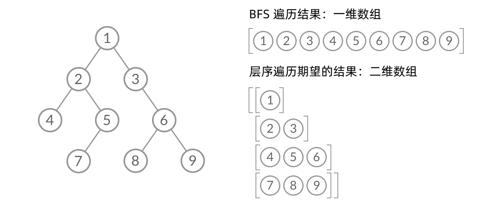
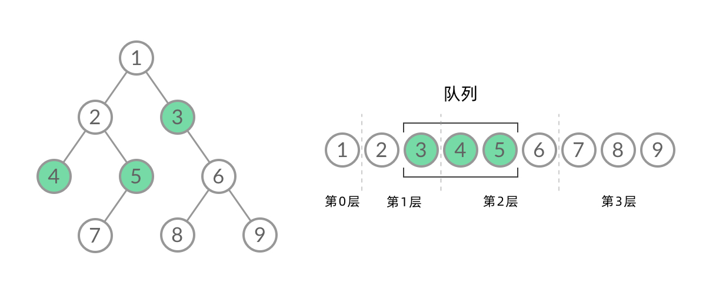

- [1. 不分层结果](#1-不分层结果)
- [2. 分层结果](#2-分层结果)
  - [2.1. 入队时的错位](#21-入队时的错位)
  - [2.2. 🚀出队时记录](#22-出队时记录)
- [锯齿形层序遍历](#锯齿形层序遍历)


---

https://leetcode.cn/problems/binary-tree-level-order-traversal/solutions/244853/bfs-de-shi-yong-chang-jing-zong-jie-ceng-xu-bian-l/


## 1. 不分层结果
出队时打印。
```java
List<Integer> result = new ArrayList<>();
Queue<TreeNode> q = new ArrayDeque<>();
if(root != null){
    q.offer(root);
}
while(!q.isEmpty()){
    TreeNode cur = q.poll();
    result.add(cur.val);

    if(cur.left != null){
        q.offer(cur.left);
    }
    if(cur.right != null){
        q.offer(cur.right);
    }
}
return result;
```
## 2. 分层结果

层序遍历顺序和 BFS 是一样的，我们可以直接用 BFS 得出层序遍历结果。然而，层序遍历要求的输入结果和 BFS 是不同的。层序遍历要求我们区分每一层，也就是返回一个二维数组。而 BFS 的遍历结果是一个一维数组，无法区分每一层。

  

那么，怎么给 BFS 遍历的结果分层呢？我们首先来观察一下 BFS 遍历的过程中，结点进队列和出队列的过程：


截取 BFS 遍历过程中的某个时刻：

  

可以看到，此时队列中的结点是 3、4、5，分别来自第 1 层和第 2 层。这个时候，第 1 层的结点还没出完，第 2 层的结点就进来了，而且两层的结点在队列中紧挨在一起，我们无法区分队列中的结点来自哪一层。

因此，我们需要稍微修改一下代码，在每一层遍历开始前，先记录队列中的结点数量 n（也就是这一层的结点数量），然后用for循环一口气处理完这一层的 n 个结点。

这样，我们就将 BFS 遍历改造成了层序遍历。可以看到，在 while 循环的每一轮中，都是将当前层的所有结点出队列，再将下一层的所有结点入队列，这样就实现了层序遍历。


### 2.1. 入队时的错位
遍历弹出当前层，入队下一层的结点、记录下一层结点的值：
- 根结点要特意写记录。
- 左右子结点也要分开写记录。
- 会出现最后一层叶子结点时，for循环里左右子结点都是空，从而level就是[]的情况，所以最后要判断level.size，要不然就会出现`[[3],[9,20],[15,7],[]]`，多了一个`[]`。

```cpp
class Solution {
    public List<List<Integer>> levelOrder(TreeNode root) {
        List<List<Integer>> result = new ArrayList<>();
        Queue<TreeNode> q = new ArrayDeque<>();
        if(root != null){
            q.offer(root);
            List<Integer> level = new ArrayList<>();
            level.add(root.val);
            result.offer(level);
        }
        while(!q.isEmpty()){
            int n = q.size();
            List<Integer> level = new ArrayList<>();
            for(int i = 0 ; i < n; i++){
                TreeNode cur = q.poll();
                
                if(cur.left != null){
                    q.offer(cur.left);
                    level.add(cur.left.val);
                }
                if(cur.right != null){
                    q.offer(cur.right);
                    level.add(cur.right.val);
                }
            }
            if(!level.isEmpty())
                result.add(level);
        }
        return result;
    }
}
```

### 2.2. 🚀出队时记录
遍历弹出当前层、记录弹出的结点值，入队下一层的结点：
- 注意到`c1`和`c2`与队列的关系，可以简化。
- 简单。根节点不用特殊处理，下一层的结点也不用特殊记录、不会出现最后一层为空的情况。
```cpp
// class Solution {
//     public List<List<Integer>> levelOrder(TreeNode root) {
//         List<List<Integer>> result = new ArrayList<>();
//         Queue<TreeNode> q = new ArrayDeque<>();
//         if(root != null){
//             q.offer(root);
//         }
//         int c1 = 1;
//         while(!q.isEmpty()){
//             List<Integer> result2 = new ArrayList<>();
//             int c2 = 0;
//             for(int i = 0 ; i < c1; i++){
//                 TreeNode p = q.poll();
//                 result2.add(p.val);
//                 if(p.left != null){
//                     q.offer(p.left);
//                     c2++;
//                 }
//                 if(p.right != null){
//                     q.offer(p.right);
//                     c2++;
//                 }
//             }
//             c1 = c2;
//             result.add(result2);
//         }
//         return result;
//     }
// }
class Solution {
    public List<List<Integer>> levelOrder(TreeNode root) {
        List<List<Integer>> result = new ArrayList<>();
        Queue<TreeNode> q = new ArrayDeque<>();
        if(root != null){
            q.offer(root);
        }
        while(!q.isEmpty()){
            int n = q.size();
            List<Integer> level = new ArrayList<>();
            for(int i = 0 ; i < n; i++){
                TreeNode cur = q.poll();
                level.add(cur.val);
                
                if(cur.left != null){
                    q.offer(cur.left);
                }
                if(cur.right != null){
                    q.offer(cur.right);
                }
            }
            result.add(level);
        }
        return result;
    }
}
```
## 锯齿形层序遍历
- 变动的是记录每层int值的level，每层的结果添加时是栈还是队列。
- 而不是变动如何添加左右子树。
```java
class Solution {
    public List<List<Integer>> zigzagLevelOrder(TreeNode root) {
        List<List<Integer>> res = new ArrayList<>();
        LinkedList<TreeNode> q = new LinkedList<>();

        if (root != null) {
            q.add(root);
        }
        boolean isReversed = false;
        while (!q.isEmpty()) {
            LinkedList<Integer> level = new LinkedList<>();
            int n = q.size();
            for (int i = 0; i < n; i++) {
                TreeNode cur = q.pop();
                // 变动level是add和push。
                if (!isReversed) {
                    level.add(cur.val);
                } else {
                    level.push(cur.val);
                }
                if (cur.left != null) {
                    q.add(cur.left);
                }
                if (cur.right != null) {
                    q.add(cur.right);
                }
            }
            isReversed = !isReversed;
            res.add(level);
        }
        return res;
    }
}
```