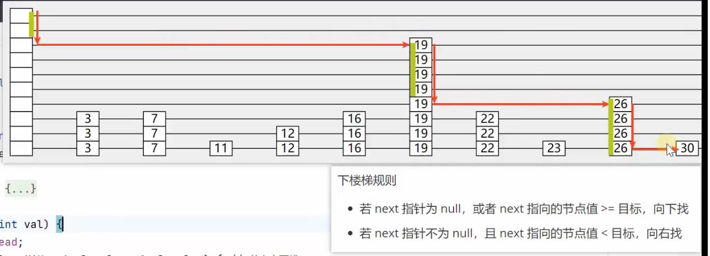

```java
// 1206. 设计跳表
class Skiplist {
    final int MAX_LEVEL = 10;
    Random r = new Random();

    static class Node{
        int val;
        Node[] next;
        int level;

        public Node(int val, int level){
            this.val = val;
            this.level = level;
            next = new Node[level];
        }
    }

    Node head = new Node(-1, MAX_LEVEL);

    public Skiplist() {

    }

    public Node[] findPath(int target){
        Node[] path = new Node[MAX_LEVEL];
        Node cur = head;
        for(int i = MAX_LEVEL - 1; i >= 0; i--){
            // null和大于等于是向下找，即什么都不做的for
            // 非null 且 小于是向右找
            while(cur.next[i] != null && cur.next[i].val < target){
                cur = cur.next[i];
            }
            path[i] = cur;
        }
        return path;
    }
    
    public boolean search(int target) {
        Node[] path = findPath(target);
        Node tar = path[0].next[0];
        if(tar == null || tar.val != target){
            return false;
        }else{
            return true;
        }
    }
    
    public void add(int num) {
        Node[] path = findPath(num);

        int level = randomLevel();
        Node added = new Node(num, level);
        for(int i = 0; i < level; i++){
            added.next[i] = path[i].next[i];
            path[i].next[i] = added;
        }
    }
    
    public boolean erase(int num) {
        Node[] path = findPath(num);
        Node tar = path[0].next[0];
        if(tar == null || tar.val != num){
            return false;
        }
        else{
            for(int i = 0 ; i < tar.level; i++){
                path[i].next[i] = tar.next[i];
            }
            return true;
        }
    }

    // 一级索引中元素个数应该占原始数据的 50%，二级索引中元素个数占 25%，三级索引12.5% ，一直到最顶层。
    // 该 randomLevel 方法会随机生成 1~MAX_LEVEL 之间的数，且 ：
    //        50%的概率返回 1
    //        25%的概率返回 2
    //      12.5%的概率返回 3 ...
    public int randomLevel(){
        int l = 1;
        while(r.nextBoolean() && l < MAX_LEVEL){
            l++;
        }
        return l;
    }
}
```