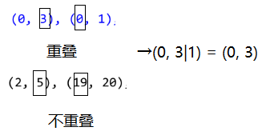

先按照区间的左端点排序。

把第一个数组加入到结果数组中。

遍历 intervals 当前数组，如果当前数组的头在结果数组的右边，则不重合，直接加入；否则，在左边或相等，则重叠，更新结果数组的尾为最大值。



```java
class Solution {
    public int[][] merge(int[][] intervals) {
        Arrays.sort(intervals, (o1, o2) -> o1[0] - o2[0]);
        List<int[]> merged = new ArrayList<>();
        for(int i = 0; i < intervals.length; i++){
            int l = intervals[i][0], r = intervals[i][1];
            // 如果第一个
            // 如果当前数组的头，在merged中最后一个数组的右边，则不重叠
            if(i == 0 || merged.get(merged.size() - 1)[1] < l){
                merged.add(new int[]{l, r});
            }
            else{
                // 重叠，则更新数组的尾
                merged.get(merged.size() - 1)[1] = Math.max(merged.get(merged.size() - 1)[1], r);
            }
        }
        return merged.toArray(new int[0][0]);
    }
}
```